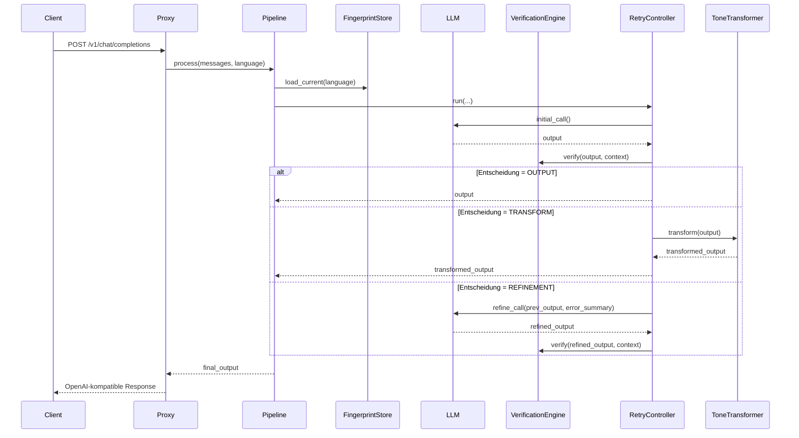

# Runtime-Pipeline

## Hauptablauf

Die Laufzeit-Pipeline wird in `mdal/pipeline.py` orchestriert.  
Der Einstiegspunkt ist `PipelineOrchestrator.process(messages, language)`.

## Tatsächlicher Ablauf im Code

## Rolle der einzelnen Laufzeitobjekte

### `PipelineOrchestrator`
Verbindet die Komponenten, bleibt selbst request-seitig zustandslos und legt pro Request einen `SessionContext` an.

### `SessionContext`
Liegt in `mdal/session.py` und hält ephemere Request-/Session-Informationen, unter anderem:

- Session-ID
- Sprache
- Fingerprint-Version
- Prüfhistorie

### `RetryController`
`mdal/retry.py` kapselt die Schleife aus:

- LLM initial aufrufen
- Ergebnis prüfen
- je nach Entscheidung zurückgeben, transformieren oder verfeinern

### Refinement-Mechanismus
Der Refinement-Prompt wird in `mdal/pipeline.py` gebaut.  
Dabei wird der vorherige Output zusammen mit einer Fehlerzusammenfassung an die ursprünglichen Messages angehängt. Das verändert den ursprünglichen Kontext nicht, sondern erweitert ihn.

## Entscheidungslogik in der Laufzeit

Der Runtime-Pfad kennt drei finale Ausgänge:

- **OUTPUT** → unveränderte Ausgabe
- **TRANSFORM** → Ausgabe wird lokal regelbasiert angepasst
- **REFINEMENT** → erneuter LLM-Aufruf

Nur wenn ein Ergebnis nach der Verifikation als ausreichend gilt, gelangt es zurück an den Client.

## Wichtige Invarianten

- der Transformer zählt **nicht** als zusätzlicher LLM-Aufruf
- Retry-Limit gilt für echte LLM-Aufrufe
- bei ausgeschöpftem Limit wird der Output zurückgehalten
- Statusmeldungen werden entlang der Pipeline emittiert
