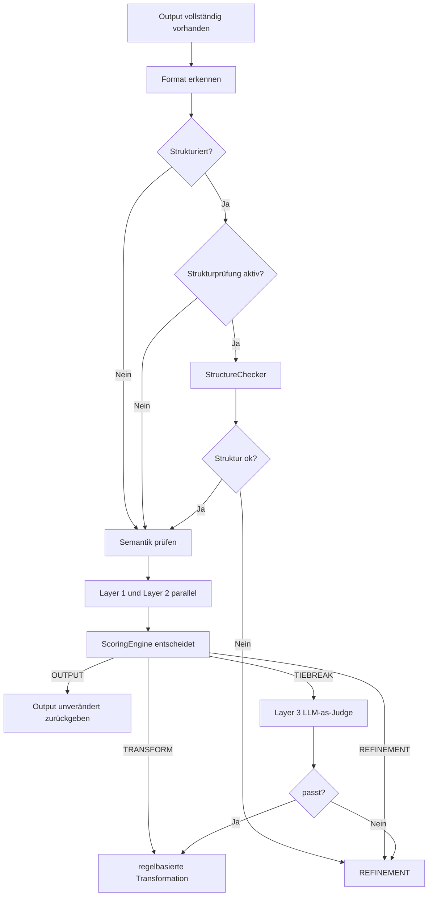

# Verifikation und Scoring

## Überblick

Die Verifikation ist der Kern des Systems. Sie wird in `mdal/verification/engine.py` orchestriert.

Der Code kombiniert zwei Prüfdimensionen:

- **Struktur** für JSON/XML
- **Semantik/Stil** für alle Outputs

## Entscheidungskaskade

## Format-Erkennung

`mdal/verification/detector.py` erkennt, ob ein Output als:

- JSON
- XML
- Prosa

behandelt wird.

Die Doku-Notiz in `bearbeitungshinweise.txt` ist wichtig: **Malformed JSON wird absichtlich nicht als strukturierter JSON-Output behandelt, wenn das Parsing fehlschlägt.** In diesem Fall landet der Output als Prosa im System. Strukturfehler greifen also nur auf erfolgreich erkanntem JSON/XML.

## Strukturprüfung

Die Strukturprüfung liegt in `mdal/verification/structure.py`.

### XML
Für XML läuft die Prüfung in zwei möglichen Stufen:

1. XSD-Validierung, wenn das Plugin `schema.xsd` liefert
2. Elementlisten-Validierung, wenn das Plugin `elements.json` liefert

Die Plugin-Auflösung erfolgt typischerweise über den XML-Namespace.

### JSON
Für JSON wird analog mit Plugin-Regeln gearbeitet; ohne passendes Plugin bleibt zumindest die syntaktische Wohlgeformtheit relevant.

### Plugins
`mdal/plugins/registry.py` lädt Plugins aus dem Dateisystem.  
Erwartet wird pro Plugin ein Ordner mit mindestens:

- `manifest.json`
- und mindestens einer der Dateien:
  - `schema.xsd`
  - `elements.json`

Ungültige Plugins werden übersprungen statt den gesamten Start abzubrechen.

## Semantikprüfung

### Layer 1 — Regelprüfung
`mdal/verification/semantic/layer1.py`

Diese Schicht arbeitet deterministisch gegen den Fingerprint:

- Formalitätsniveau
- Satzlängenheuristik
- bevorzugtes / zu vermeidendes Vokabular
- benutzerdefinierte Regeln

Die Heuristik ist bewusst kalibrierbar; darauf weist `bearbeitungshinweise.txt` explizit hin.

### Layer 2 — Embedding-Vergleich
`mdal/verification/semantic/layer2.py`

Diese Schicht berechnet ein Embedding des aktuellen Outputs und vergleicht es per Cosine Similarity mit dem Fingerprint-Centroid.  
Die Schwellwerte sind direkt im Modul sichtbar:

- `THRESHOLD_HIGH = 0.85`
- `THRESHOLD_LOW  = 0.65`

### Layer 3 — LLM-as-Judge
`mdal/verification/semantic/layer3.py`

Diese Schicht wird nur im Tiebreak-Fall aktiviert.  
Sie erhält Golden Samples aus dem Fingerprint und entscheidet binär, ob der Stil passt.

## ScoringEngine

`mdal/verification/semantic/scorer.py` setzt die Entscheidungstabelle um:

- low in S1 oder S2 → `REFINEMENT`
- high in S1 und S2 → `OUTPUT`
- high + medium → `TRANSFORM`
- medium + medium → `TIEBREAK`

Nach Layer 3 gilt:

- passt → `TRANSFORM`
- passt nicht → `REFINEMENT`

## Parallelisierung

Layer 1 und Layer 2 werden in `VerificationEngine._run_semantic_parallel()` per `ThreadPoolExecutor` parallel ausgeführt.  
Das ist im PoC relevant, weil Layer 2 einen Netzwerkaufruf zum Embedding-Endpunkt auslöst.
