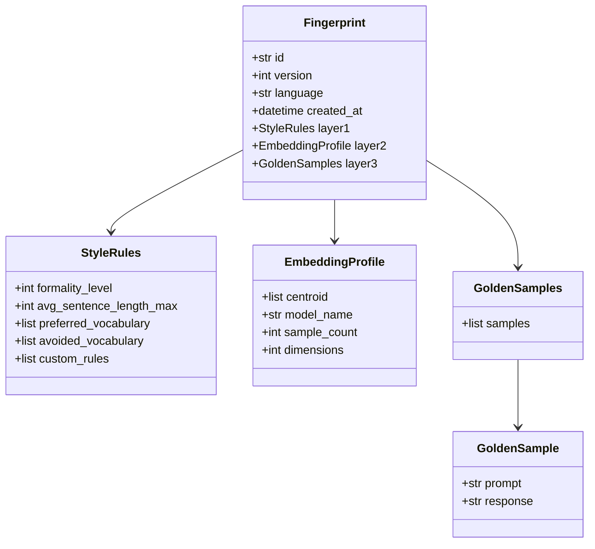
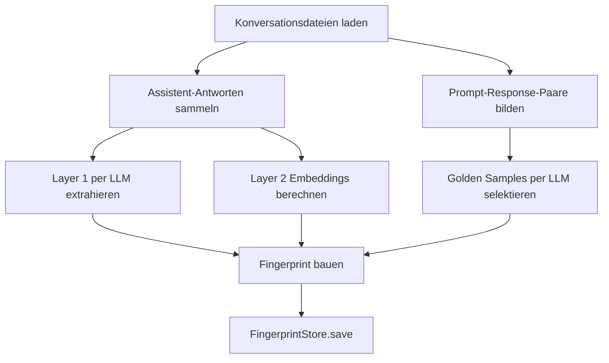

# Trainer und Fingerprint-Modell

## Fingerprint-Datenmodell

Das Datenmodell liegt in `mdal/fingerprint/models.py`.



## FingerprintStore

`mdal/fingerprint/store.py` speichert Fingerprints dateisystembasiert und versioniert.

### Tatsächliche Verzeichnisstruktur

```text
{base_path}/
  de/
    current
    v1.json
    v2.json
  en/
    current
    v1.json
```

### Verhalten

- `save()` vergibt die nächste Versionsnummer
- `load_current()` lädt die aktive Version
- `load_version()` lädt explizite Versionen
- `rollback()` setzt den Pointer `current` zurück

Wichtig: Der Store ist laut Modulkommentar **nicht für gleichzeitige Schreibzugriffe ausgelegt**.  
In `phasenplanung.txt` ist deshalb ein späterer Locking-Fix als Pre-Go-Live-Maßnahme vermerkt.

## Offline-Trainer

Der Trainer liegt in `mdal/trainer/trainer.py` und wird per CLI über `mdal-train` aufgerufen.

## Trainer-Ablauf



## Was der Trainer konkret tut

### Layer 1
Aus Assistent-Antworten wird per LLM ein JSON mit Stilregeln extrahiert:

- Formalität
- maximale Satzlänge
- bevorzugtes Vokabular
- vermiedenes Vokabular
- Freitextregeln

### Layer 2
Für jede Assistent-Antwort wird ein Embedding erzeugt; daraus bildet der Trainer den Centroid.

### Layer 3
Aus User/Assistant-Turn-Paaren werden repräsentative Golden Samples selektiert.

## Wichtige Implementation Details

### Fallback bei Golden-Sample-Selektion
Wenn die LLM-Antwort für die Sample-Selektion kein brauchbares JSON liefert, verwendet der Trainer die ersten N Kandidaten.  
Das ist laut `bearbeitungshinweise.txt` bewusst die einzige tolerierte stille Fallback-Stelle, weil es sich um Offline-Kalibrierung handelt.

### Kein entsprechender Fallback in Layer 1
Die Stilregel-Extraktion bricht bei unbrauchbarem JSON ab und wirft `TrainerError`.

### CLI
`trainer.py` enthält neben der Kernlogik auch:

- Dateilader für JSON-Konversationen
- Argumentparser
- Startpunkt `main()`

Damit ist das Modul gleichzeitig Bibliotheks- und CLI-Einstiegspunkt.
