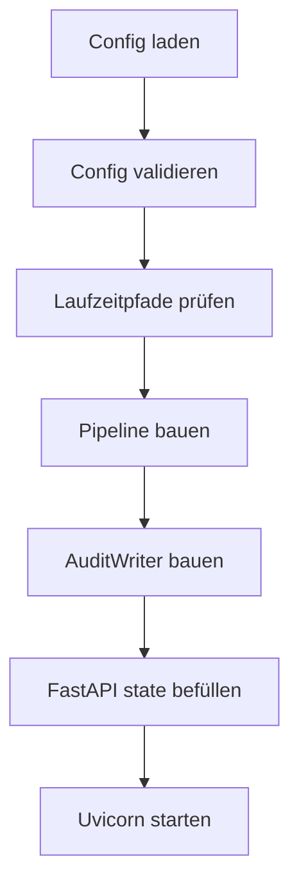

# Proxy, Startup und Betrieb

## Proxy-Schicht

Die Proxy-Implementierung liegt in `mdal/proxy/`.

### Enthaltene Module

- `models.py` — OpenAI-kompatible Request/Response-Modelle
- `app.py` — FastAPI-App und Endpunkte
- `startup.py` — Factory-Funktionen zum Verdrahten der Pipeline
- `server.py` — CLI-Einstiegspunkt und Uvicorn-Start

## API-Oberfläche

Der zentrale Laufzeitendpunkt ist:

- `POST /v1/chat/completions`

Zusätzlich gibt es:

- `GET /health`

## Request-/Response-Modell

`mdal/proxy/models.py` bildet absichtlich die OpenAI Chat Completions API nach.

Wesentliche Einschränkungen des aktuellen PoC:

- `stream=True` wird abgelehnt
- `usage`-Werte sind Platzhalter
- zusätzliche Request-Felder werden zugelassen und durchgereicht
- Tool-/Function-bezogene Felder werden nicht ausgewertet

## Startup-Reihenfolge

`mdal/proxy/server.py` zeigt die tatsächliche Boot-Reihenfolge:

## `build_pipeline()` in `startup.py`

Diese Factory verdrahtet:

- LLM-Adapter
- Embedding-Adapter
- PluginRegistry
- FingerprintStore
- Layer 1, 2, 3
- ScoringEngine
- VerificationEngine
- AdminNotifier
- RetryController
- RuleBasedToneTransformer
- PipelineOrchestrator

Das Modul ist damit die zentrale technische Montage-Stelle des Systems.

## LLM-Adapter

`mdal/llm/adapter.py` implementiert einen OpenAI-kompatiblen HTTP-Adapter.

### Fähigkeiten

- `complete()` für Chat Completions
- `embed()` für Embeddings
- `health_check()` via `/v1/models`

### Fehlerklassen

- `LLMUnavailableError`
- `LLMResponseError`

Diese Fehler werden im Proxy gezielt in passende HTTP-Antworten übersetzt.

## Konfiguration

`mdal/config.py` + `config/mdal.yaml`

### Validierung
Die Konfiguration wird zweistufig geprüft:

1. **Strukturell** via Pydantic beim Laden
2. **operativ** via Pfadprüfung in `validate_runtime_paths()`

### Wichtige Konfigurationsbereiche

- `llm`
- `embedding`
- `fingerprint_path`
- `plugin_registry_path`
- `audit`
- `checks`
- `notifier`
- `fallback_llm`
- `max_retries`

## Audit und Benachrichtigung

### Audit
`mdal/audit.py` implementiert einen write-only AuditWriter, aktuell mit JSONL-Datei als Ziel.

### Notifier
`mdal/notifier.py` informiert Administratoren bei:

- erschöpftem Retry-Limit
- erkannter Fähigkeits-Asymmetrie

Die Kanäle sind:

- Logdatei
- Webhook

Fehler in der Benachrichtigung sollen den Hauptpfad nicht blockieren.

## Statusmeldungen

Die Status-API liegt in `mdal/status.py`.  
Im Proxy-Betrieb wird laut `startup.py` der `LoggingStatusReporter` verwendet.
