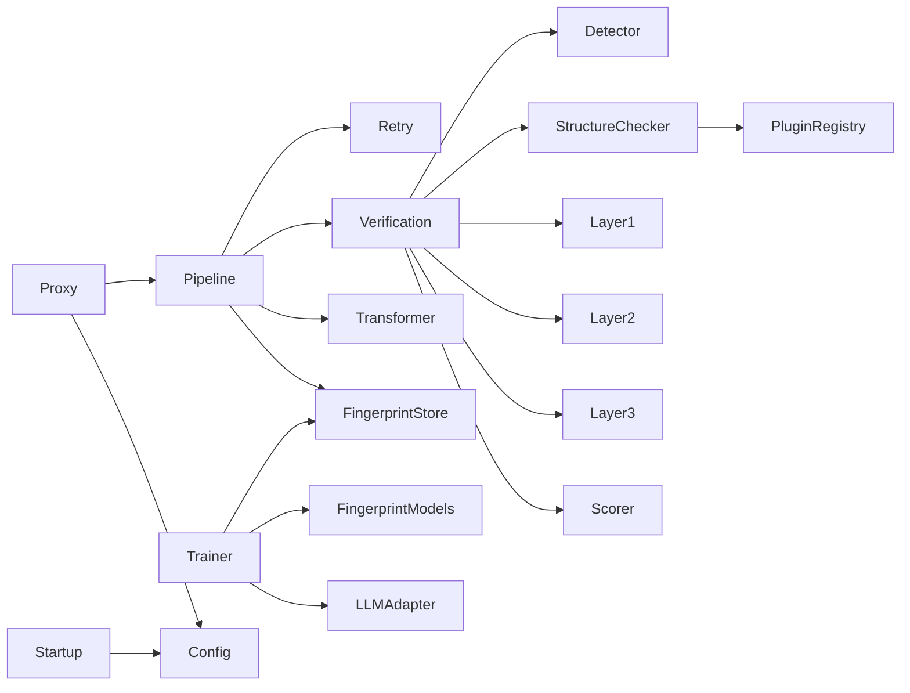

# Repository-Struktur

## Top-Level

```text
MDAL-main/
├── .claude/
├── config/
├── mdal/
├── tests/
├── .gitignore
├── CLAUDE.md
├── MDAL-Architekturskizze-v05.docx
├── MDAL-Stack-Entscheidung.md
├── bearbeitungshinweise.txt
├── llm-normalization-layer-anforderungen.md
├── phasenplanung.txt
└── pyproject.toml
```

## Bedeutung der Top-Level-Bereiche

### `mdal/`
Produktionscode des Python-PoC.

### `tests/`
Automatisierte Tests, getrennt in:

- `unit/`
- `integration/`
- `regression/`

### `config/`
Beispielkonfiguration (`mdal.yaml`).

### `MDAL-Stack-Entscheidung.md`
Architekturentscheidung zum Technologie-Stack.

### `llm-normalization-layer-anforderungen.md`
Anforderungsdokument mit den funktionalen Leitplanken.

### `phasenplanung.txt`
Roadmap und offene Pre-Go-Live-Fixes.

### `bearbeitungshinweise.txt`
Dokumentiert fachlich relevante Beobachtungen aus der bisherigen Arbeit.

## Struktur innerhalb von `mdal/`

```text
mdal/
├── __init__.py
├── audit.py
├── config.py
├── notifier.py
├── pipeline.py
├── retry.py
├── session.py
├── status.py
├── transformer.py
├── fingerprint/
│   ├── __init__.py
│   ├── models.py
│   └── store.py
├── interfaces/
│   ├── __init__.py
│   ├── fingerprint.py
│   ├── llm.py
│   ├── scoring.py
│   └── transformer.py
├── llm/
│   ├── __init__.py
│   └── adapter.py
├── plugins/
│   ├── __init__.py
│   └── registry.py
├── proxy/
│   ├── __init__.py
│   ├── app.py
│   ├── models.py
│   ├── server.py
│   └── startup.py
├── trainer/
│   ├── __init__.py
│   └── trainer.py
└── verification/
    ├── __init__.py
    ├── detector.py
    ├── engine.py
    ├── structure.py
    └── semantic/
        ├── __init__.py
        ├── layer1.py
        ├── layer2.py
        ├── layer3.py
        └── scorer.py
```

## Abhängigkeitsrichtung in groben Zügen



## Teststruktur

### Unit-Tests
Prüfen einzelne Module isoliert, z. B.:

- Audit
- Config
- FingerprintStore
- Layer 1 / Layer 2
- Retry
- Scorer
- Transformer
- Trainer

### Integrationstests
Prüfen das Zusammenspiel mehrerer Komponenten, z. B.:

- API-Proxy
- strukturierte Pipeline
- Prosa-Pipeline
- Retry-Eskalation

### Regressionstests
Sichern bekannte Entscheidungsfälle, insbesondere die Scoring-Entscheidungen.
