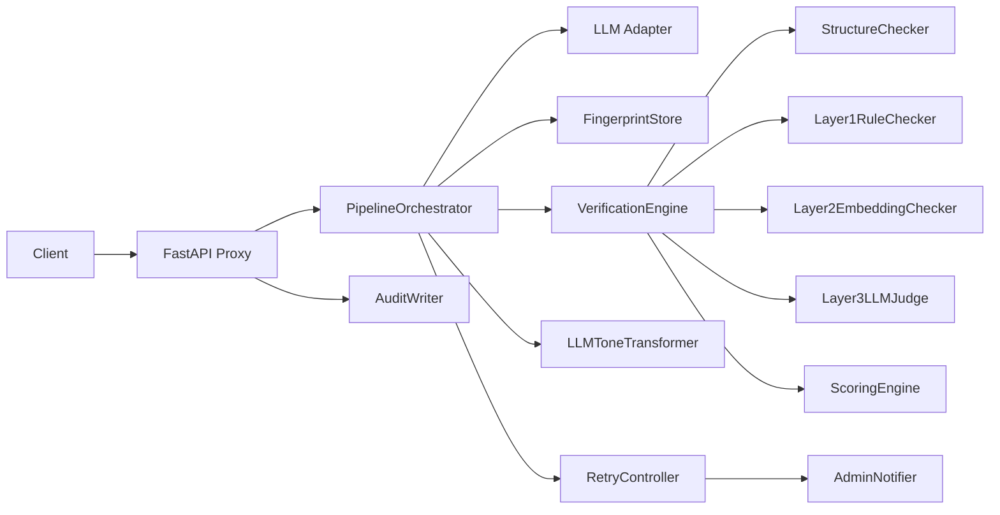

# Systemüberblick

## Was das Repo tatsächlich implementiert

Das Projekt implementiert einen **Model-agnostic Delivery Assurance Layer** zwischen Client und LLM. Der zentrale Mechanismus ist immer derselbe:

1. Client liefert Chat-Nachrichten.
2. MDAL ruft ein LLM auf.
3. MDAL prüft den vollständigen LLM Output.
4. MDAL entscheidet zwischen:
   - direkt ausgeben
   - via LLM transformieren (inkl. Faktencheck und Confidence Scoring)
   - erneuten LLM-Refinement-Call auslösen
5. Bei ausgeschöpftem Retry-Limit wird **kein Output** an den Client ausgeliefert.

## Zentrale fachliche Bausteine

### 1. Fingerprint
Der gewünschte Zielstil wird als versionierter Fingerprint pro Sprache gespeichert.  
Das Datenmodell liegt in `mdal/fingerprint/models.py` und umfasst drei Schichten:

- **Layer 1:** deterministische Stilregeln
- **Layer 2:** Embedding-Centroid des Zielstils
- **Layer 3:** Golden Samples für LLM-as-Judge

### 2. Verifikation
Die Verifikation wird in `mdal/verification/engine.py` orchestriert und kombiniert:

- optionale Strukturprüfung (`verification/structure.py`)
- semantische Prüfung Layer 1 und 2 parallel
- Layer 3 nur als Tiebreaker
- finale Entscheidung via `verification/semantic/scorer.py`

### 3. Transformation
`mdal/transformer.py` implementiert eine **LLM-basierte** Tonanpassung (`LLMToneTransformer`).  
Wichtig: Diese Transformation unterliegt strengen Regeln zur Faktentreue (Entity-Check) und bricht ab, wenn der Text zu stark verändert wird (Confidence Scoring).

### 4. Retry und Eskalation
`mdal/retry.py` begrenzt die Anzahl der LLM-Aufrufe und eskaliert nach Erschöpfung des Limits über `mdal/notifier.py`.

### 5. Proxy
`mdal/proxy/` kapselt die OpenAI-kompatible API-Oberfläche.  
Der aktuelle Hauptendpunkt ist `POST /v1/chat/completions`.

## Architektur auf Modulebene

## Wichtige Designentscheidungen, die im Code sichtbar sind

- **kein stiller Bypass:** unvollständige Konfiguration stoppt den Betrieb
- **kein Streaming im Prüfkern:** MDAL verarbeitet nur vollständige Outputs
- **Qualität vor Stil:** Faktentreue und Grammatik stehen zwingend über stilistischer Perfektion
- **Hard Language Lock:** Sprachwechsel (Sprach-Drift) werden hart blockiert
- **Fingerprint versioniert pro Sprache**
- **Layer 3 nur bei Grenzfällen**
- **Proxy ist OpenAI-kompatibel statt client-spezifisch**

## Konfigurations-UI

Der Proxy stellt eine eingebaute Browser-Benutzeroberfläche unter `GET /config` bereit und bietet eine JSON-Konfigurations-API unter `/api/config`.
Diese Oberfläche schreibt nach `config/mdal.yaml` und deckt die wichtigsten Runtime-Einstellungen ab.

Fortgeschrittene YAML-Optionen wie `fallback_llm`, `max_retries` und `language` werden derzeit noch direkt in `config/mdal.yaml` gepflegt.
