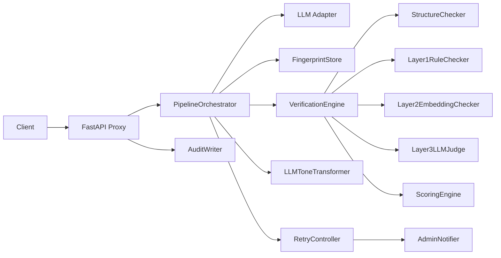

# System Overview

## What this Repository Actually Implements

The project implements a **Model-agnostic Delivery Assurance Layer** between client and LLM. The central mechanism is always the same:

1. The client submits chat messages.
2. MDAL calls an LLM.
3. MDAL evaluates the complete LLM output.
4. MDAL decides between:
   - delivering directly
   - transforming via LLM (including fact-check and confidence scoring)
   - triggering a new LLM refinement call
5. When the retry limit is exhausted, **no output** is delivered to the client.

## Core Domain Components

### 1. Fingerprint
The desired target style is stored as a versioned fingerprint per language.
The data model lives in `mdal/fingerprint/models.py` and comprises three layers:

- **Layer 1:** deterministic style rules
- **Layer 2:** embedding centroid of the target style
- **Layer 3:** golden samples for LLM-as-Judge

### 2. Verification
Verification is orchestrated in `mdal/verification/engine.py` and combines:

- optional structure checking (`verification/structure.py`)
- semantic checking Layers 1 and 2 in parallel
- Layer 3 only as a tiebreaker
- final decision via `verification/semantic/scorer.py`

### 3. Transformation
`mdal/transformer.py` implements an **LLM-based** tone adjustment (`LLMToneTransformer`).
Important: this transformation is subject to strict rules regarding factual accuracy (entity check) and aborts if the text is altered too heavily (confidence scoring).

### 4. Retry and Escalation
`mdal/retry.py` limits the number of LLM calls and escalates after the limit is exhausted via `mdal/notifier.py`.

### 5. Proxy
`mdal/proxy/` encapsulates the OpenAI-compatible API surface.
The primary endpoint is `POST /v1/chat/completions`.

## Architecture at Module Level

## Key Design Decisions Visible in the Code

- **no silent bypass:** incomplete configuration stops operation
- **no streaming in the verification core:** MDAL processes only complete outputs
- **quality over style:** factual accuracy and grammar take mandatory precedence over stylistic perfection
- **hard language lock:** language switches (language drift) are blocked unconditionally
- **fingerprint versioned per language**
- **Layer 3 only for edge cases**
- **proxy is OpenAI-compatible rather than client-specific**
