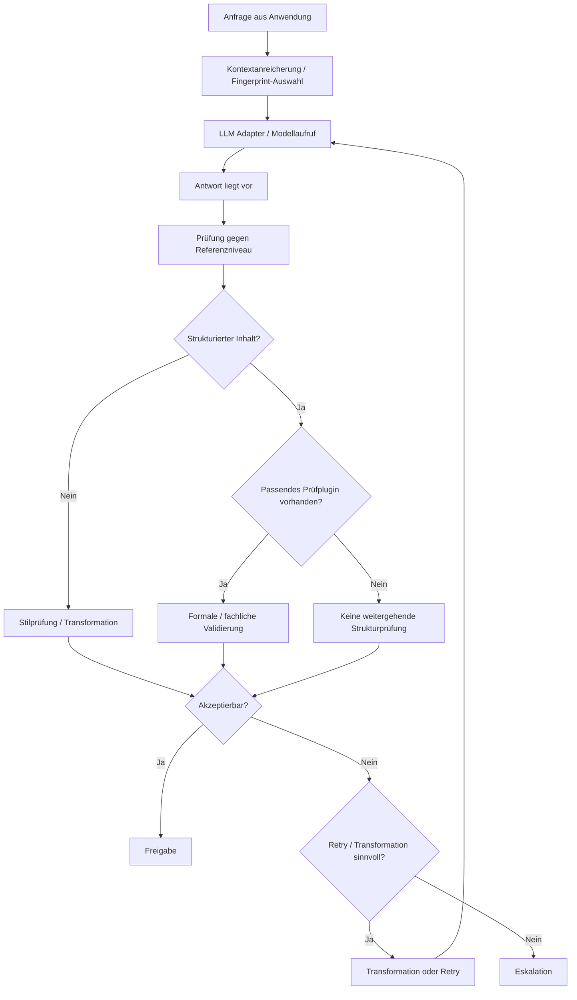

# Runtime Pipeline

## Überblick

Die Runtime Pipeline beschreibt den kontrollierten Verarbeitungsweg einer Anfrage durch MDAL. Ziel der Pipeline ist nicht nur die Erzeugung einer Modellantwort, sondern deren Einordnung gegen ein bekanntes Referenzniveau sowie – falls möglich und erforderlich – eine zusätzliche strukturbezogene Validierung.

Wichtig ist dabei die fachliche Trennung der Prüftiefe:
- Bei freier Prosa erfolgt primär eine Stilprüfung gegen den Fingerprint und bei Bedarf eine Transformation.
- Bei strukturierten Inhalten kann zusätzlich eine fachliche oder formale Validierung stattfinden, allerdings nur dann, wenn ein passendes Prüfplugin oder Schema vorhanden ist.

Die Pipeline ist damit kein bloßer Durchleitungsmechanismus, sondern ein gesteuerter Qualitäts- und Stabilisierungsprozess.

## Ablauf

### 1. Eingang der Anfrage

Eine konsumierende Anwendung übergibt eine Anfrage an MDAL. Diese Anfrage enthält die eigentliche Nutzlast sowie kontextuelle Informationen, die für Fingerprint-Auswahl, Session-Kontext und Verifikationsverhalten relevant sein können.

### 2. Vorbereitung und Kontextanreicherung

Vor dem eigentlichen Modellaufruf wird die Anfrage in die laufende Verarbeitung eingebettet. Dazu können insbesondere gehören:
- Auswahl oder Laden eines geeigneten Fingerprints
- Einbeziehung von Session-Kontext
- Aktivierung optionaler Prüfplugins
- Setzen von Laufzeitparametern für Retry und Transformation

### 3. Modellaufruf

Das Zielmodell wird über den jeweils konfigurierten Adapter angesprochen. MDAL selbst trifft hier noch keine Aussage darüber, ob die erzeugte Antwort fachlich verwendbar ist. Der Modellaufruf liefert zunächst lediglich ein Roh-Ergebnis.

### 4. Prüfung gegen Referenzniveau

Nach dem Modellaufruf wird das Ergebnis gegen das bekannte Referenzniveau eingeordnet. Bei freier Prosa bedeutet das insbesondere:
- Prüfung der Stiltreue
- Erkennung von Drift gegenüber dem gewünschten Antwortverhalten
- Entscheidung, ob eine Transformation oder ein Retry sinnvoll erscheint

Diese Stufe ist keine pauschale inhaltliche Qualitätsprüfung. Sie bewertet in erster Linie die Nähe zum erwarteten Zielverhalten.

### 5. Optionale Strukturvalidierung

Wenn das Ergebnis strukturierte Inhalte enthält und für diesen Inhaltstyp ein passendes Prüfplugin vorhanden ist, kann zusätzlich eine fachliche oder formale Validierung stattfinden.

Beispiele:
- XML gegen ein bekanntes Schema
- strukturierte Artefakte gegen domänenspezifische Regeln
- modellierte Inhalte gegen formale Konsistenzbedingungen

Fehlt ein solches Plugin, endet die Prüftiefe an der allgemeinen Stil- und Verhaltensprüfung. MDAL darf dann keine weitergehende Strukturqualität behaupten, die es faktisch nicht geprüft hat.

### 6. Entscheidung über Freigabe, Transformation, Retry oder Eskalation

Auf Basis der verfügbaren Prüfergebnisse entscheidet MDAL über das weitere Vorgehen:
- direkte Freigabe
- Transformation
- erneuter Modelllauf
- Eskalation

Die Entscheidung hängt dabei sowohl vom Inhaltstyp als auch von der tatsächlich verfügbaren Prüfbasis ab.

## Pipeline im Überblick

## Fachliche Einordnung

Die Runtime Pipeline operationalisiert den Kernanspruch von MDAL: Schwankungen des Modellverhaltens sollen nicht ungefiltert beim Nutzer ankommen. Gleichzeitig wird bewusst vermieden, der Pipeline mehr Prüftiefe zuzuschreiben, als tatsächlich vorhanden ist.

Daraus ergibt sich eine klare Trennung:
- Prosa wird primär auf Stiltreue und Verhaltensnähe zum Referenzniveau geprüft.
- Strukturierte Inhalte können zusätzlich validiert werden, aber nur mit passendem Plugin.
- Ohne Plugin ist die Aussagekraft über Struktur begrenzt und muss entsprechend behandelt werden.
