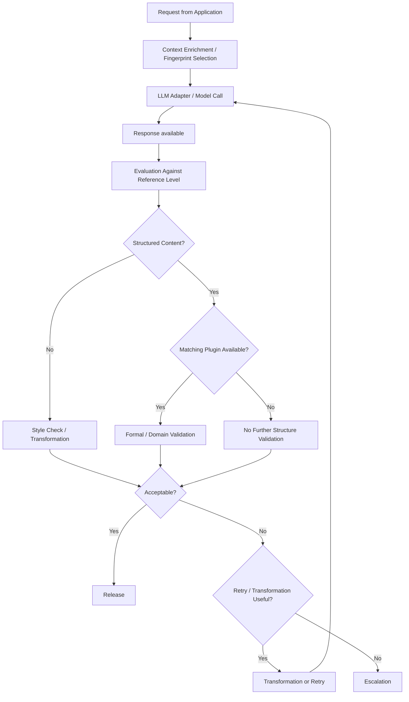

# Runtime Pipeline

## Overview

The runtime pipeline describes the controlled processing path of a request through MDAL. The pipeline's goal is not merely to produce a model response, but to evaluate it against a known reference level and — where possible and necessary — apply additional structure-oriented validation.

An important domain-level distinction in processing depth applies:
- For free-form prose, the primary check is a style evaluation against the fingerprint, with transformation applied if needed.
- For structured content, additional domain-specific or formal validation may take place, but only when a matching validation plugin or schema is available.

The pipeline is therefore not a mere passthrough mechanism, but a controlled quality and stabilization process.

## Flow

### 1. Request Intake

A consuming application submits a request to MDAL. This request contains the actual payload as well as contextual information relevant to fingerprint selection, session context, and verification behavior.

### 2. Preparation and Context Enrichment

Before the model call, the request is embedded into the current processing context. This may include:
- selecting or loading an appropriate fingerprint
- incorporating session context
- activating optional validation plugins
- setting runtime parameters for retry and transformation

### 3. Model Call

The target model is invoked via the configured adapter. At this point MDAL makes no statement about whether the generated response is domain-usable. The model call initially returns only a raw result.

### 4. Evaluation Against Reference Level

After the model call, the result is evaluated against the known reference level. For free-form prose this means:
- checking style fidelity
- detecting drift from the expected response behavior
- deciding whether transformation or a retry is appropriate

This stage is not a blanket content quality check. It evaluates primarily the proximity to the expected target behavior.

### 5. Optional Structure Validation

If the result contains structured content and a matching validation plugin is available for that content type, additional domain-specific or formal validation may take place.

Examples:
- XML against a known schema
- structured artifacts against domain-specific rules
- modeled content against formal consistency conditions

If no such plugin is present, the validation depth ends at the general style and behavior check. MDAL must not claim structural quality it has not actually verified.

### 6. Decision on Release, Transformation, Retry, or Escalation

Based on the available verification results, MDAL decides on the next course of action:
- direct release
- transformation
- new model run
- escalation

The decision depends on both the content type and the actually available verification basis.

## Pipeline Overview

## Domain Classification

The runtime pipeline operationalizes MDAL's core claim: fluctuations in model behavior must not reach the user unfiltered. At the same time, it deliberately avoids attributing more validation depth to the pipeline than actually exists.

This results in a clear separation:
- Prose is evaluated primarily for style fidelity and behavioral proximity to the reference level.
- Structured content may be additionally validated, but only with a matching plugin.
- Without a plugin, the expressiveness regarding structure is limited and must be treated accordingly.
