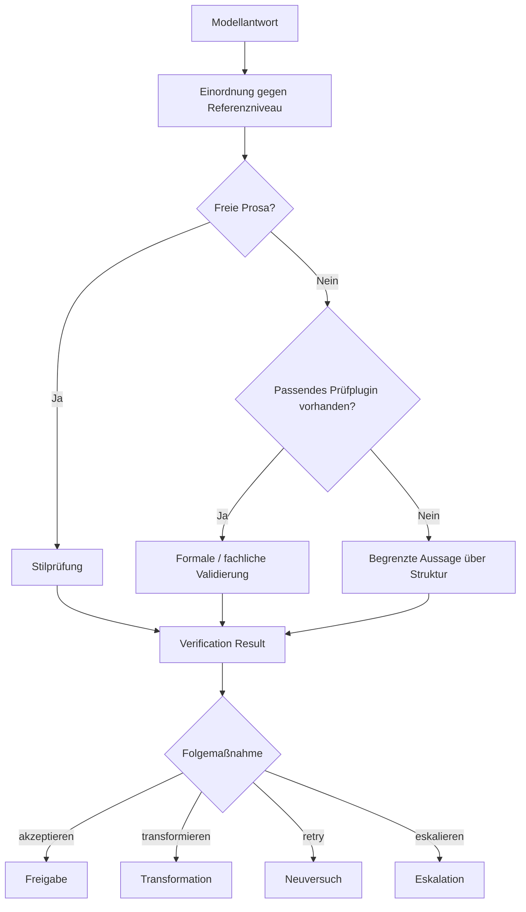

# Verification

## Ziel der Verification

Die Verification in MDAL dient dazu, Modellantworten nicht nur technisch entgegenzunehmen, sondern sie im Rahmen der tatsächlich verfügbaren Prüfbasis einzuordnen. Sie entscheidet also nicht abstrakt über „gut“ oder „schlecht“, sondern darüber, ob ein Ergebnis im jeweiligen Kontext ausreichend belastbar ist.

Wichtig ist die fachliche Abgrenzung:
- MDAL führt nicht automatisch für jede Antwort eine umfassende qualitative Inhaltsprüfung durch.
- Bei freier Prosa erfolgt primär eine Stilprüfung gegen das bekannte Referenzniveau.
- Eine weitergehende fachliche oder formale Validierung ist nur dort möglich, wo ein passendes Prüfplugin oder Schema vorhanden ist.

## Verification-Ebenen

### 1. Stilprüfung gegen Referenzniveau

Diese Ebene ist der generelle Kern der Verification. Sie bewertet, wie nah eine Antwort am erwarteten Zielverhalten liegt. Typische Aspekte sind:
- Tonalität
- Antwortcharakter
- formale Konsistenz im weiteren Sinn
- Nähe zum Fingerprint

Diese Prüfung ist besonders relevant für freie Prosa. Sie dient der Dämpfung von Model-Shift-Effekten und der Stabilisierung des Nutzererlebnisses.

### 2. Strukturbezogene Validierung

Wenn ein Ergebnis strukturierte Inhalte enthält und ein passendes Plugin vorhanden ist, kann eine zusätzliche Validierung stattfinden. Diese geht über Stilprüfung hinaus und adressiert unter anderem:
- syntaktische Korrektheit
- formale Zulässigkeit
- domänenspezifische Regeln
- Schema-Konformität

Ein Beispiel wäre die Validierung eines ArchiMate-XML gegen das passende Schema oder gegen ergänzende Regelwerke.

### 3. Ableitung einer Folgemaßnahme

Verification endet nicht bei der Feststellung eines Befunds. Sie erzeugt ein auswertbares Ergebnis für die nächste Prozessentscheidung:
- akzeptieren
- transformieren
- retry
- eskalieren

## Warum diese Trennung wichtig ist

Ohne diese Unterscheidung würde die Doku suggerieren, MDAL könne jede Antwort fachlich umfassend validieren. Genau das wäre zu viel behauptet.

Die tatsächliche Prüftiefe hängt vom Inhaltstyp ab:
- **Freie Prosa**: Stilprüfung und ggf. Transformation
- **Strukturierte Inhalte mit Plugin**: zusätzliche formale oder fachliche Validierung
- **Strukturierte Inhalte ohne Plugin**: keine belastbare Strukturprüfung möglich

Damit ist Verification in MDAL bewusst gestuft statt pauschal.

## Verification-Ablauf

## Verification Result

Das Verification Result bündelt die Erkenntnisse der Prüfung in einer Form, die für den weiteren Ablauf nutzbar ist. Es kann unter anderem enthalten:
- Bewertung der Stiltreue
- Hinweise auf Abweichungen vom Fingerprint
- Ergebnisse einer Plugin-Validierung
- Grenzen der Aussagekraft, wenn keine Prüfbasis vorhanden ist
- empfohlene Folgemaßnahme

## Fachlicher Nutzen

Der Nutzen der Verification liegt nicht darin, jede Modellantwort „objektiv“ zu bewerten. Der Nutzen liegt darin, die jeweils real verfügbare Prüftiefe sauber zu operationalisieren und daraus belastbare Prozessentscheidungen abzuleiten.

Dadurch wird vermieden, dass:
- stilistische Drift unbemerkt bleibt
- formale Fehler strukturierter Inhalte übersehen werden, wenn eine Prüfbasis vorhanden ist
- fehlende Prüfbasis fälschlich wie eine bestandene Validierung behandelt wird
