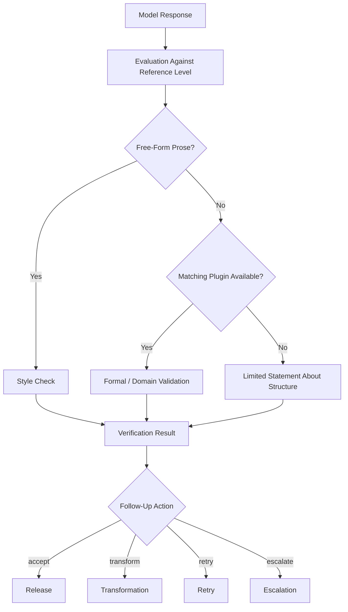

# Verification

## Purpose of Verification

Verification in MDAL does not merely receive model responses technically — it evaluates them within the scope of the actually available verification basis. It does not decide abstractly between "good" and "bad", but rather whether a result is sufficiently reliable in a given context.

An important domain distinction applies:
- MDAL does not automatically perform a comprehensive qualitative content check for every response.
- For free-form prose, the primary check is a style evaluation against the known reference level.
- Further domain-specific or formal validation is only possible where a matching validation plugin or schema is available.

## Verification Layers

### 1. Style Check Against Reference Level

This layer is the general core of verification. It evaluates how closely a response matches the expected target behavior. Typical aspects include:
- tonality
- response character
- formal consistency in a broader sense
- proximity to the fingerprint

This check is particularly relevant for free-form prose. It serves to dampen model-shift effects and stabilize the user experience.

### 2. Structure-Oriented Validation

If a result contains structured content and a matching plugin is available, additional validation may take place. This goes beyond style checking and addresses:
- syntactic correctness
- formal permissibility
- domain-specific rules
- schema conformance

An example would be the validation of ArchiMate XML against the appropriate schema or supplementary rule sets.

### 3. Deriving a Follow-Up Action

Verification does not end at a finding. It produces an actionable result for the next process decision:
- accept
- transform
- retry
- escalate

## Why This Distinction Matters

Without this distinction, the documentation would suggest that MDAL can comprehensively validate every response from a domain perspective. That would be claiming too much.

The actual verification depth depends on the content type:
- **Free-form prose**: style check and transformation if needed
- **Structured content with plugin**: additional formal or domain validation
- **Structured content without plugin**: no reliable structure check possible

Verification in MDAL is therefore deliberately graduated rather than blanket.

## Verification Flow

## Verification Result

The verification result consolidates the findings in a form usable for subsequent processing. It may contain:
- style fidelity assessment
- indications of deviations from the fingerprint
- results of a plugin validation
- limits of expressiveness when no verification basis is available
- recommended follow-up action

## Domain Value

The value of verification lies not in "objectively" evaluating every model response. The value lies in cleanly operationalizing the actually available verification depth for each case and deriving reliable process decisions from it.

This prevents:
- stylistic drift going unnoticed
- formal errors in structured content being overlooked when a verification basis is available
- a missing verification basis being incorrectly treated as a passed validation
