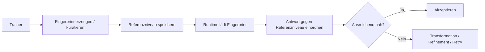

# Trainer and Fingerprint

## Überblick

Der Trainer- und Fingerprint-Bereich beschreibt, wie MDAL ein bekanntes Referenzniveau für erwartbares Modellverhalten aufbaut und zur Laufzeit nutzt. Der zentrale Gedanke ist dabei nicht, einem Modell einfach einen gewünschten Stil per Prompt mitzugeben, sondern ein belastbares Vergleichsniveau zu schaffen, gegen das Antworten später eingeordnet werden können.

Gerade darin unterscheidet sich der Fingerprint von einer bloßen Prompt-Vorgabe: Ein Prompt beeinflusst die Erzeugung. Ein Fingerprint beschreibt das Zielniveau, gegen das das Ergebnis später geprüft wird.

## Fachliche Rolle des Fingerprints

Der Fingerprint ist das Referenzobjekt für erwartbares Verhalten eines Modells in einem bestimmten Nutzungskontext. Er steht damit zwischen zwei Extremen:
- Er ist mehr als ein einzelner Stilhinweis oder ein Few-Shot-Beispiel.
- Er ist weniger als eine vollständige fachliche Garantie über jeden Inhalt.

Fachlich dient der Fingerprint vor allem dazu:
- Model-Shift-Effekte erkennbar zu machen
- Stil- und Verhaltensdrift zu dämpfen
- ein akzeptiertes Zielniveau für Antworten zu operationalisieren
- Entscheidungen über Transformation, Refinement oder Retry zu fundieren

## Abgrenzung zu ähnlichen Konzepten

### Fingerprint vs. Prompt

Ein Prompt ist eine Eingabe an das Modell. Er sagt dem Modell, was erzeugt werden soll oder wie es sich verhalten soll.

Ein Fingerprint ist dagegen kein Steuerbefehl an das Modell, sondern ein Referenzrahmen für die Bewertung des erzeugten Ergebnisses. Er kann aus denselben inhaltlichen Domänen stammen wie ein Prompt, erfüllt aber eine andere Funktion.

Kurz:
- Prompt = beeinflusst die Erzeugung
- Fingerprint = bewertet die Erzeugung gegen ein Zielniveau

### Fingerprint vs. Few-Shot-Beispiele

Few-Shot-Beispiele demonstrieren dem Modell ein gewünschtes Muster direkt im Prompt-Kontext. Sie dienen primär der In-Context-Steuerung.

Ein Fingerprint ist dauerhafter und systemischer gedacht:
- nicht bloß Demonstration eines Musters
- sondern referenzierbare Erwartung an wiederkehrendes Verhalten
- nicht nur zur Generierung, sondern zur Einordnung und Stabilisierung

### Fingerprint vs. Policy

Eine Policy formuliert Regeln oder Grenzen, etwa „antworte knapp“ oder „verwende keine Halluzinationen“. Policies sind normative Vorgaben.

Ein Fingerprint ist demgegenüber stärker empirisch und referenzbasiert. Er repräsentiert ein bekanntes akzeptiertes Niveau, das aus Training, Auswahl oder Kuratierung hervorgegangen ist. Er beschreibt daher nicht nur Soll-Regeln, sondern ein tatsächlich akzeptiertes Vergleichsmuster.

## Warum der Fingerprint nötig ist

Ohne Fingerprint bleibt die Bewertung einer Modellantwort diffus. Man kann zwar sagen, dass eine Antwort „gut klingt“ oder „nicht so wirkt wie früher“, aber diese Einschätzung bleibt schwer operationalisierbar.

Der Fingerprint macht daraus einen überprüfbaren Mechanismus:
- Es gibt ein bekanntes Zielniveau.
- Antworten werden dagegen eingeordnet.
- Abweichungen werden nicht nur gespürt, sondern systematisch behandelt.

Damit ist der Fingerprint ein Kernbaustein für die Reduktion von Model-Shift-Erfahrungen.

## Was der Fingerprint leisten kann – und was nicht

### Was er leisten kann

- Referenzniveau für Stil und Antwortcharakter bereitstellen
- Drift im Antwortverhalten sichtbar machen
- Entscheidungen über Transformation, Refinement und Retry unterstützen
- Konsistenz innerhalb definierter Nutzungskontexte erhöhen

### Was er nicht leisten kann

- keine vollständige inhaltliche oder fachliche Validierung jedes Outputs
- keine Determinisierung des Modells
- kein Ersatz für Plugin-basierte Strukturvalidierung
- keine Garantie, dass jedes Modell bei jedem Thema dasselbe Niveau erreicht

## Rolle des Trainers

Der Trainer dient dazu, Fingerprints nicht rein intuitiv, sondern reproduzierbar aufzubauen. Das Ziel ist ein belastbares Referenzobjekt, das später im Betrieb nutzbar ist.

Fachlich bedeutet das:
- Auswahl eines akzeptierten Zielniveaus
- Ableitung oder Kuratierung der relevanten Referenzmerkmale
- Ablage in einer Form, die von der Runtime referenziert werden kann
- mögliche Versionierung nach Modellstand, Kontext oder Sprache

Der Trainer ist damit kein bloßes Komfortwerkzeug, sondern der vorbereitende Schritt zur Operationalisierung des Referenzniveaus.

## Laufzeitnutzung

Zur Laufzeit wird der Fingerprint nicht primär „an das Modell geschickt“, sondern als Bewertungsgrundlage verwendet. Er beeinflusst damit die Entscheidung, ob ein Ergebnis:
- akzeptiert
- transformiert
- verfeinert
- erneut erzeugt
- oder eskaliert wird

Der Fingerprint ist also ein Bestandteil der Kontrollschicht, nicht nur der Erzeugungsschicht.

## Überblick Trainer → Fingerprint → Runtime

## Fachliche Kernaussage

Der Fingerprint ist in MDAL nicht bloß ein hübscher Name für Stilvorgaben. Er ist das betriebliche Referenzniveau für erwartbares Verhalten. Genau dadurch wird aus einem unscharfen Eindruck von Modell-Drift ein kontrollierbarer Mechanismus zur Stabilisierung des Nutzererlebnisses.
