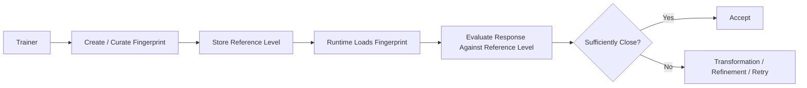

# Trainer and Fingerprint

## Overview

The trainer and fingerprint area describes how MDAL builds a known reference level for expected model behavior and uses it at runtime. The central idea is not simply to provide a desired style to a model via a prompt, but to establish a reliable comparison level against which responses can later be evaluated.

This is precisely what distinguishes the fingerprint from a mere prompt specification: a prompt influences generation. A fingerprint describes the target level against which the result is later verified.

## Domain Role of the Fingerprint

The fingerprint is the reference object for expected model behavior in a particular usage context. It stands between two extremes:
- It is more than a single style hint or a few-shot example.
- It is less than a complete domain-level guarantee over every piece of content.

From a domain perspective the fingerprint primarily serves to:
- make model-shift effects recognizable
- dampen style and behavior drift
- operationalize an accepted target level for responses
- substantiate decisions about transformation, refinement, or retry

## Distinction from Similar Concepts

### Fingerprint vs. Prompt

A prompt is an input to the model. It tells the model what to produce or how to behave.

A fingerprint, by contrast, is not a control command to the model but a reference frame for evaluating the produced result. It may originate from the same content domains as a prompt, but it fulfills a different function.

In short:
- Prompt = influences generation
- Fingerprint = evaluates generation against a target level

### Fingerprint vs. Few-Shot Examples

Few-shot examples demonstrate a desired pattern to the model directly within the prompt context. They serve primarily for in-context steering.

A fingerprint is conceived as more durable and systemic:
- not merely a demonstration of a pattern
- but a referenceable expectation for recurring behavior
- not only for generation, but for evaluation and stabilization

### Fingerprint vs. Policy

A policy formulates rules or constraints, such as "answer concisely" or "avoid hallucinations". Policies are normative specifications.

A fingerprint is, by contrast, more empirical and reference-based. It represents a known accepted level that has emerged from training, selection, or curation. It therefore describes not only target rules, but an actually accepted comparison pattern.

## Why the Fingerprint Is Necessary

Without a fingerprint, the evaluation of a model response remains diffuse. One can say that a response "sounds good" or "doesn't feel like before", but this impression remains difficult to operationalize.

The fingerprint turns this into a verifiable mechanism:
- There is a known target level.
- Responses are evaluated against it.
- Deviations are not merely sensed, but systematically addressed.

The fingerprint is thus a core component in reducing model-shift experiences.

## What the Fingerprint Can — and Cannot — Do

### What it can do

- Provide a reference level for style and response character
- Make drift in response behavior visible
- Support decisions on transformation, refinement, and retry
- Increase consistency within defined usage contexts

### What it cannot do

- no complete content or domain validation of every output
- no determinization of the model
- no replacement for plugin-based structure validation
- no guarantee that every model reaches the same level on every topic

## Role of the Trainer

The trainer serves to build fingerprints reproducibly rather than intuitively. The goal is a reliable reference object that is usable in production.

From a domain perspective this means:
- selecting an accepted target level
- deriving or curating the relevant reference characteristics
- storing them in a form referenceable by the runtime
- potential versioning by model state, context, or language

The trainer is therefore not merely a convenience tool, but the preparatory step for operationalizing the reference level.

## Runtime Usage

At runtime the fingerprint is not primarily "sent to the model", but used as the basis for evaluation. It influences the decision of whether a result is:
- accepted
- transformed
- refined
- regenerated
- or escalated

## Trainer Control

The repository includes a basic trainer control in the configuration UI. The `/api/trainer/start` endpoint is currently wired to spawn a Windows terminal and run the commercial trainer flow from `config/trainer_commercial.yaml` using a fixed sample input. This is currently a bootstrap/test workflow rather than a fully generic browser-driven trainer workflow.

The fingerprint is therefore a component of the control layer, not just the generation layer.

## Overview: Trainer → Fingerprint → Runtime

## Core Domain Statement

The fingerprint in MDAL is not merely a fancy name for style specifications. It is the operational reference level for expected behavior. This is precisely what turns a vague sense of model drift into a controllable mechanism for stabilizing the user experience.
