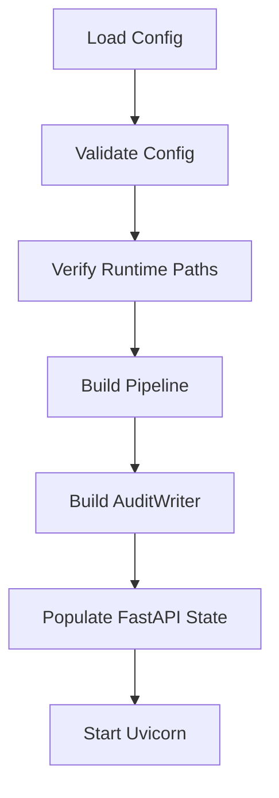

# Proxy, Startup, and Operations

## Proxy Layer

The proxy implementation lives in `mdal/proxy/`.

### Included Modules

- `models.py` — OpenAI-compatible request/response models
- `app.py` — FastAPI app and endpoints
- `startup.py` — factory functions for wiring the pipeline
- `server.py` — CLI entry point and Uvicorn startup

## API Surface

The primary runtime endpoint is:

- `POST /v1/chat/completions`

Additionally:

- `GET /health`

## Request / Response Model

`mdal/proxy/models.py` deliberately mirrors the OpenAI Chat Completions API.

Key limitations of the current PoC:

- `stream=True` is rejected
- `usage` values are placeholders
- additional request fields are allowed and passed through
- tool/function-related fields are not evaluated

## Startup Sequence

`mdal/proxy/server.py` shows the actual boot sequence:

## `build_pipeline()` in `startup.py`

This factory wires together:

- LLM adapter
- embedding adapter
- PluginRegistry
- FingerprintStore
- Layer 1, 2, 3
- ScoringEngine
- VerificationEngine
- AdminNotifier
- RetryController
- LLMToneTransformer
- PipelineOrchestrator

This module is the central technical assembly point of the system.

## LLM Adapter

`mdal/llm/adapter.py` implements an OpenAI-compatible HTTP adapter.

### Capabilities

- `complete()` for chat completions
- `embed()` for embeddings
- `health_check()` via `/v1/models`

### Error Classes

- `LLMUnavailableError`
- `LLMResponseError`

These errors are intentionally translated into appropriate HTTP responses in the proxy.

## Configuration

`mdal/config.py` + `config/mdal.yaml`

### Validation
Configuration is validated in two stages:

1. **Structurally** via Pydantic at load time
2. **Operationally** via path verification in `validate_runtime_paths()`

### Key Configuration Areas

- `llm`
- `embedding`
- `fingerprint_path`
- `plugin_registry_path`
- `audit`
- `checks`
- `notifier`
- `fallback_llm`
- `max_retries`

## Audit and Notification

### Audit
`mdal/audit.py` implements a write-only AuditWriter, currently targeting a JSONL file.

### Notifier
`mdal/notifier.py` notifies administrators when:

- the retry limit is exhausted
- a capability asymmetry is detected

Supported channels:

- log file
- webhook

Errors in notification must not block the main processing path.

## Status Reporting

The status API lives in `mdal/status.py`.
In proxy operation, `startup.py` uses the `LoggingStatusReporter`.
