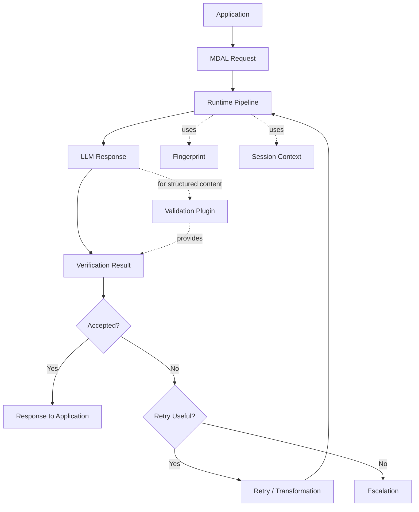

# Domain Model

## Purpose of MDAL

MDAL was developed to decouple applications from fluctuations in underlying large language models. Language models change their behavior across model upgrades, version changes, configuration updates, or provider switches. Without a compensating intermediate layer, this leads to an unstable user experience: responses may shift noticeably in style, structure, completeness, or reliability, even though the application itself has not changed.

MDAL addresses this problem by not passing model responses through unverified, but evaluating them against a known reference level. The goal is not to enforce identical responses on every call. The goal is rather to ensure a stable, predictable quality level and to reduce perceptible model-shift effects for the user.

An important domain boundary applies: MDAL does not perform a blanket content quality check of every result. For free-form prose the primary check is style fidelity against the reference level, with transformation applied if needed. Further qualitative or domain-specific validation only takes place where a matching validation plugin is available for the respective structured content. An ArchiMate XML, for example, can only be validated formally or domain-specifically if the corresponding schema or plugin is available.

## Domain Role in the Overall System

From a domain perspective, MDAL is a quality and stabilization layer between the consuming application and the language model. This layer assumes the following responsibilities in particular:

- dampening model-shift effects
- evaluating responses against a known reference level
- style checking of free-form prose and transformation if needed
- validation of structured content via plugins where a matching verification basis is available
- controlled remediation of deviations
- regulated escalation for unresolvable violations

MDAL deliberately does not assume the domain responsibility of the consuming application. It replaces neither business logic nor domain rules of the calling system. It stabilizes and controls the interaction with the model.

## Core Domain Objects

### MDAL Request

The MDAL request is the domain unit with which an application triggers a model processing run. It contains the user input, the execution context, and any additional control information for verification and runtime behavior.

### Fingerprint

The fingerprint is the central reference object of MDAL. From a domain perspective it describes an accepted target level against which model responses are evaluated. This may include linguistic style, structural characteristics, completeness expectations, or typical response characteristics.

A fingerprint is not a mere prompt template. It is also not simply equivalent to few-shot examples or a policy. It is an operationalized reference for expected model behavior.

Key properties:
- version-bound, since reference levels belong to particular model states
- context-bound, since different use cases require different target levels
- potentially language-bound, where language-specific quality characteristics are relevant
- only domain-useful if it can be reproducibly trained, stored, and referenced

### Verification Result

The verification result summarizes the outcome of the check. It documents whether a response was accepted, which deviations were detected, and which follow-up action results from this.

Typical domain content:
- accepted or not accepted
- detected style deviations from the reference level
- indications for transformation or remediation
- plugin-based validation results, where available
- basis for retry or escalation

### Session Context

The session context holds transient information that contributes to consistency within the retry loop of a single request. It exists exclusively for the duration of that retry loop and is discarded afterwards. MDAL is conversation-less — the upstream application manages conversation context itself.

This is particularly relevant for:
- consistent fingerprint application across initial response and refinements within the same request
- traceability of verification decisions during the retry cycle

### Retry and Escalation

Retry and escalation are not technical side effects, but domain-defined reactions to deviations.

- Retry means: a response is not yet acceptable, but can presumably be improved through a new generation or targeted remediation.
- Escalation means: the system leaves the normal quality loop because an acceptable result could not be achieved within the defined limits.

## Domain Model Overview

## Quality Gates & Defensive Strategies

To transition MDAL from "aggressive adaptation" to "defensive normalization" (system humility), three quality gates are anchored as mandatory requirements for the runtime pipeline:

### Pillar A: Subject Guardrail
* **Requirement:** The transformer must extract topic anchors from the original prompt (e.g. "executive").
* **Validation:** MDAL discards the transformation if the main subject in the output has been replaced by terms from the profile context (e.g. "service provider").

### Pillar B: Short-Text Bypass
* **Requirement:** Introduction of automatic length detection in the MDAL Request.
* **Logic:** If the raw output is < 300 characters, rigid structural requirements (introduction/conclusion) from the fingerprint are deactivated to prevent unnecessary N/A escalations.

### Pillar C: Minimal-Invasive Transformation ("The Demure Mode")
* **Design Principle:** In the `CREATIVE` and `DIALOG` domains, MDAL switches from "rewrite" to "repair".
* **Prioritization:** Grammatical correctness takes absolute precedence over style fidelity. When in doubt, leave the style unchanged rather than produce an unnatural transformation.

## Core Domain Statement

MDAL is not an ordinary proxy for model calls. Its actual contribution is transforming unstable, model-dependent response behavior into a controlled and evaluable processing pipeline. The fingerprint provides the reference level for style and expected response behavior. Further domain-specific or formal validation occurs only where matching validation plugins are available.
