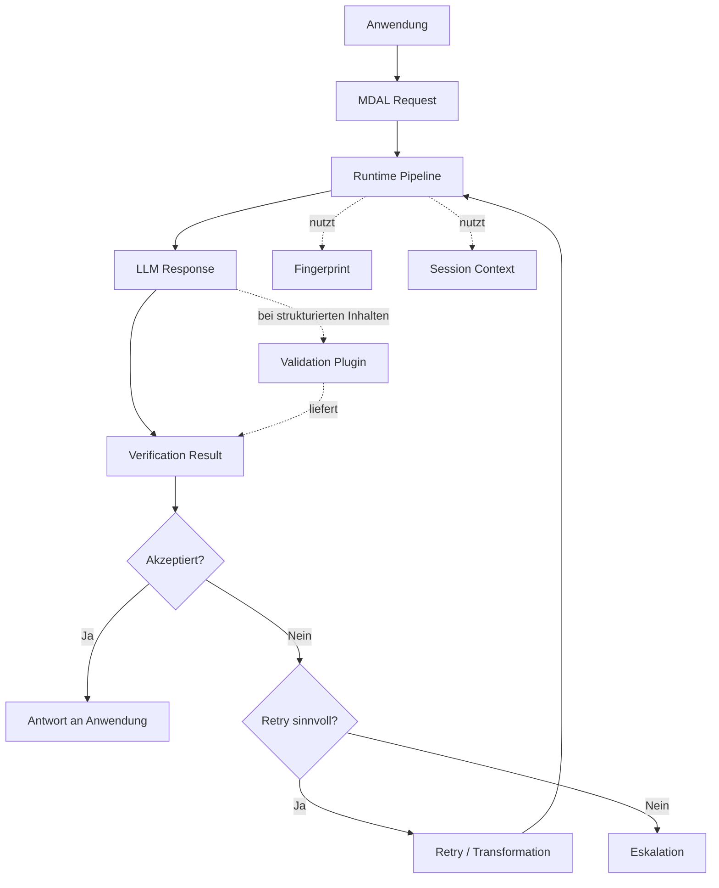

# Fachliches Domänenmodell

## Zweck von MDAL

MDAL wurde entwickelt, um Anwendungen von Schwankungen zugrunde liegender Large Language Models zu entkoppeln. Sprachmodelle verändern ihr Verhalten über Modellwechsel, Versionswechsel, Konfigurationsänderungen oder Anbieterwechsel hinweg. Ohne eine ausgleichende Zwischenschicht führt das zu einem instabilen Nutzererlebnis: Antworten können sich im Stil, in der Struktur, in der Vollständigkeit oder in der Zuverlässigkeit merklich verschieben, obwohl die Anwendung selbst unverändert geblieben ist.

MDAL adressiert dieses Problem, indem Modellantworten nicht ungeprüft weitergereicht, sondern gegen ein bekanntes Referenzniveau bewertet werden. Ziel ist nicht, bei jedem Aufruf identische Antworten zu erzwingen. Ziel ist vielmehr, ein stabiles, erwartbares Qualitätsniveau sicherzustellen und wahrnehmbare Model-Shift-Effekte für den Nutzer zu reduzieren.

Wichtig ist dabei die fachliche Abgrenzung: MDAL führt nicht pauschal eine inhaltliche Qualitätsprüfung jedes Ergebnisses durch. Bei freier Prosa erfolgt primär eine Prüfung auf Stiltreue zum Referenzniveau und bei Bedarf eine Transformation. Eine weitergehende qualitative oder fachliche Prüfung findet nur dann statt, wenn für den jeweiligen strukturierten Inhalt ein passendes Prüfplugin vorhanden ist. Ein ArchiMate-XML kann beispielsweise nur dann fachlich oder formal validiert werden, wenn das entsprechende Schema bzw. Plugin verfügbar ist.

## Fachliche Rolle im Gesamtsystem

Fachlich ist MDAL eine Qualitäts- und Stabilisierungsschicht zwischen konsumierender Anwendung und Sprachmodell. Diese Schicht übernimmt insbesondere folgende Verantwortungen:

- Dämpfung von Model-Shift-Effekten
- Bewertung von Antworten gegen ein bekanntes Referenzniveau
- Stilprüfung freier Prosa und ggf. Transformation
- Validierung strukturierter Inhalte über Plugins, sofern passende Prüfbasis vorliegt
- kontrollierte Nachbesserung bei Abweichungen
- geregelte Eskalation bei nicht behebbaren Verstößen

MDAL übernimmt bewusst nicht die fachliche Verantwortung der konsumierenden Anwendung. Es ersetzt weder Geschäftslogik noch Domänenregeln des aufrufenden Systems. Es stabilisiert und kontrolliert die Interaktion mit dem Modell.

## Zentrale Fachobjekte

### MDAL Request

Der MDAL Request ist die fachliche Einheit, mit der eine Anwendung eine Modellverarbeitung anstößt. Er enthält die Nutzereingabe, den Ausführungskontext sowie gegebenenfalls zusätzliche Steuerinformationen für Verifikation und Laufzeitverhalten.

### Fingerprint

Der Fingerprint ist das zentrale Referenzobjekt von MDAL. Fachlich beschreibt er ein akzeptiertes Zielniveau, gegen das Modellantworten bewertet werden. Dazu können unter anderem sprachlicher Stil, Strukturmerkmale, Vollständigkeitserwartungen oder typische Antwortcharakteristika gehören.

Ein Fingerprint ist keine bloße Prompt-Vorlage. Er ist auch nicht einfach mit Few-Shot-Beispielen oder einer Policy gleichzusetzen. Er ist eine operationalisierte Referenz für erwartbares Modellverhalten.

Wesentliche Eigenschaften:
- versionsgebunden, da Referenzniveaus zu bestimmten Modellständen gehören
- kontextgebunden, da unterschiedliche Anwendungsfälle unterschiedliche Zielniveaus benötigen
- potenziell sprachgebunden, sofern sprachspezifische Qualitätsmerkmale relevant sind
- nur dann fachlich nützlich, wenn er reproduzierbar trainiert, gespeichert und referenziert werden kann

### Verification Result

Das Verification Result fasst das Ergebnis der Prüfung zusammen. Es dokumentiert, ob eine Antwort akzeptiert wurde, welche Abweichungen erkannt wurden und welche Folgemaßnahme daraus entsteht.

Typische fachliche Inhalte:
- akzeptiert oder nicht akzeptiert
- erkannte Stilabweichungen gegenüber dem Referenzniveau
- Hinweise für Transformation oder Nachbesserung
- plugin-basierte Validierungsergebnisse, sofern vorhanden
- Grundlage für Retry oder Eskalation

### Session Context

Der Session Context hält flüchtige Informationen vor, die innerhalb des Retry-Loops eines einzelnen Requests zur Konsistenz beitragen. Er lebt ausschließlich für die Dauer dieses Retry-Loops und wird danach verworfen. MDAL ist konversationslos — die vorgelagerte Anwendung verwaltet den Konversationskontext selbst.

Das ist insbesondere relevant für:
- konsistente Fingerprint-Anwendung über Initial-Response und Refinements innerhalb desselben Requests
- Nachvollziehbarkeit der Prüfentscheidungen im Retry-Verlauf

### Retry und Escalation

Retry und Escalation sind keine technischen Nebeneffekte, sondern fachlich definierte Reaktionen auf Abweichungen.

- Retry bedeutet: eine Antwort ist noch nicht akzeptabel, kann aber voraussichtlich durch erneute Generierung oder gezielte Nachbesserung verbessert werden.
- Escalation bedeutet: das System verlässt den normalen Qualitätskreislauf, weil ein akzeptables Ergebnis innerhalb der vorgesehenen Grenzen nicht erreicht werden konnte.

## Domänenmodell im Überblick

## Fachliche Kernaussage

MDAL ist fachlich kein gewöhnlicher Proxy für Modellaufrufe. Die eigentliche Leistung besteht darin, ein instabiles, vom Modell abhängiges Antwortverhalten in einen kontrollierten und bewertbaren Verarbeitungsprozess zu überführen. Der Fingerprint liefert dabei das Referenzniveau für Stil und erwartbares Antwortverhalten. Eine weitergehende fachliche oder formale Validierung erfolgt nur dort, wo passende Prüfplugins vorhanden sind.
