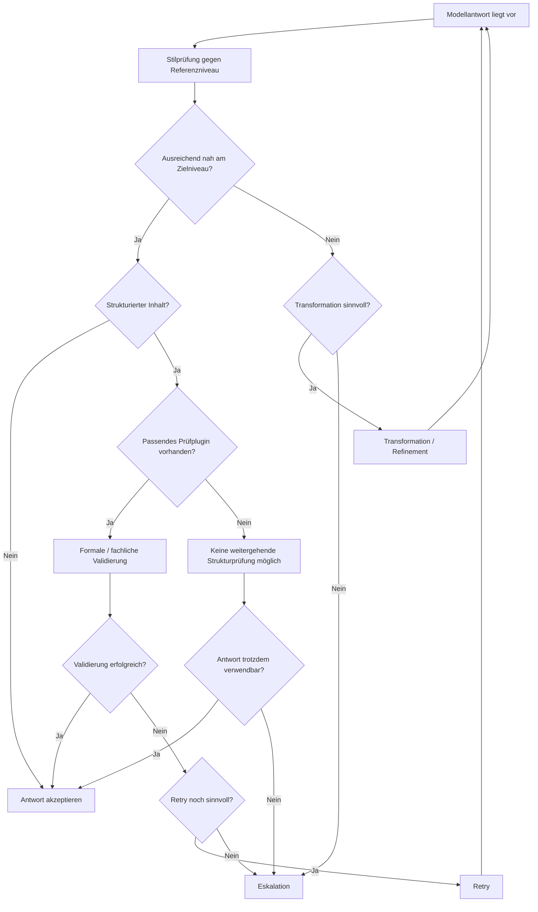

# Entscheidungsmodell

## Grundprinzip

MDAL trifft nach einer Modellantwort nicht nur die Entscheidung, ob technisch ein Ergebnis vorliegt, sondern ob dieses Ergebnis im jeweiligen Kontext verwendbar ist. Das Entscheidungsmodell trennt damit die Existenz einer Antwort von ihrer Verwendbarkeit.

Die zentrale Frage lautet nicht: „Hat das Modell etwas geliefert?“  
Die zentrale Frage lautet: „Ist das Gelieferte für das beabsichtigte Nutzungserlebnis und den jeweiligen Strukturanspruch ausreichend belastbar?“

Dabei ist die Art der Prüfung vom Inhaltstyp abhängig:
- Bei freier Prosa erfolgt primär eine Stilprüfung gegen das Referenzniveau.
- Bei strukturierten Inhalten kann zusätzlich eine fachliche oder formale Validierung erfolgen, allerdings nur dann, wenn ein passendes Prüfplugin vorhanden ist.

## Begriffsabgrenzung

Damit die Doku konsistent bleibt, werden die folgenden Begriffe in MDAL bewusst getrennt verwendet:

### Transformation

Transformation bezeichnet die gezielte Umformung einer bereits vorliegenden Modellantwort. Der bestehende Antwortkern bleibt erhalten, wird aber angepasst, um näher an das gewünschte Referenzniveau oder an eine erwartete Form zu gelangen.

Typische Fälle:
- stilistische Glättung
- Anpassung von Formulierungen
- Nachziehen einer gewünschten Antwortstruktur, soweit dies ohne vollständige Neuerzeugung möglich ist

Transformation arbeitet also auf einem vorhandenen Ergebnis.

### Refinement

Refinement ist die gezielte qualitative Nachschärfung eines bestehenden Ergebnisses. Im Unterschied zur allgemeinen Transformation ist der Begriff enger auf die Verbesserung eines bereits brauchbaren Outputs gerichtet.

Typische Fälle:
- eine Antwort ist grundsätzlich verwendbar, aber noch nicht sauber genug
- ein Ergebnis ist stilistisch nah am Zielniveau, aber noch zu roh
- kleinere Mängel sollen behoben werden, ohne den Antwortkern auszutauschen

In der Praxis ist Refinement damit ein spezieller Anwendungsfall von Transformation. Wenn beide Begriffe parallel verwendet werden, ist mit Refinement die feinere, qualitätsorientierte Form der Transformation gemeint.

### Retry

Retry bezeichnet keinen Eingriff in die vorhandene Antwort, sondern einen erneuten Modelllauf. Das bisherige Ergebnis wird also nicht umgearbeitet, sondern verworfen oder nur noch als Diagnosegrundlage betrachtet. Ziel ist die Erzeugung eines neuen Outputs.

Typische Fälle:
- die vorhandene Antwort ist grundlegend unzureichend
- eine Transformation wäre unsicherer oder teurer als ein Neuversuch
- die Abweichung vom Referenzniveau ist so groß, dass ein neuer Durchlauf sinnvoller erscheint

## Entscheidungsstufen

### 1. Annahme ohne Eingriff

Eine Antwort wird direkt akzeptiert, wenn sie im jeweiligen Kontext ausreichend nah am erwarteten Referenzniveau liegt und keine relevanten Verstöße erkannt werden. Dazu zählt insbesondere:
- ausreichende Stiltreue bei freier Prosa
- keine kritischen Strukturverstöße bei validierbaren Inhalten
- keine plugin-seitig festgestellten Fehler, sofern ein Prüfplugin aktiv ist

### 2. Transformation / Refinement

Eine Antwort wird nicht sofort verworfen, wenn die Abweichung voraussichtlich auf Basis des vorhandenen Ergebnisses korrigierbar ist. In diesem Fall erfolgt eine gezielte Transformation. Wenn die Antwort bereits tragfähig ist und nur noch qualitativ nachgeschärft werden muss, kann man präziser von Refinement sprechen.

Typische Auslöser:
- stilistische Drift gegenüber dem Referenzniveau
- kleinere formale Schwächen
- unzureichende Konsistenz im Antwortverhalten
- ein grundsätzlich brauchbarer Output, der noch verfeinert werden soll

Transformation bzw. Refinement ist fachlich sinnvoll, wenn die Antwort einen verwertbaren Kern besitzt.

### 3. Retry / Neuversuch

Ein Retry wird verwendet, wenn die Antwort nicht hinreichend verwertbar ist oder eine Transformation voraussichtlich nicht genügt. Ziel ist ein erneuter Modelllauf unter kontrollierten Bedingungen.

Ein Retry ist insbesondere dann angemessen, wenn:
- die erkannte Abweichung grundsätzlicher Natur ist
- der Antwortkern nicht tragfähig genug ist
- das System erwartet, dass Qualität oder Strukturtreue bei einem weiteren Durchlauf mit vertretbarem Aufwand verbessert werden können

### 4. Eskalation

Eine Eskalation erfolgt, wenn innerhalb der definierten Betriebsgrenzen kein akzeptables Ergebnis erzielt werden konnte oder ein Verstoß so gravierend ist, dass ein weiterer automatischer Versuch fachlich nicht mehr sinnvoll erscheint.

Das kann zum Beispiel dann der Fall sein, wenn:
- Retry-Limits erreicht wurden
- bei validierbaren strukturierten Inhalten kritische Fehler bestehen bleiben
- notwendige Prüfplugins fehlen, obwohl ohne sie keine belastbare Aussage über die Struktur möglich ist
- das Ergebnis dauerhaft nicht nahe genug am Referenzniveau liegt

## Rolle der strukturierten Validierung

Neben der Stilprüfung besitzt MDAL eine zweite, kontextsensitive Entscheidungsebene: die Validierung strukturierter Inhalte. Diese wird nur aktiv, wenn ein passendes Prüfplugin vorhanden ist.

Damit gilt fachlich:
- freie Prosa wird primär auf Stiltreue geprüft und ggf. transformiert
- strukturierte Inhalte können zusätzlich fachlich oder formal validiert werden
- ohne passendes Plugin darf keine weitergehende Qualitätsaussage über die Struktur behauptet werden

Ein Ergebnis kann daher stilistisch akzeptabel wirken, aber strukturell unzulässig sein. In diesem Fall ist es nur dann sicher erkennbar, wenn ein geeignetes Prüfplugin vorhanden ist.

## Entscheidung nach Fehlertyp

### Stilabweichung bei freier Prosa

Wenn die Antwort sprachlich oder stilistisch vom Zielniveau abweicht, liegt typischerweise ein Fall für Transformation oder – bei größerer Abweichung – Retry vor.

### Strukturverstoß bei validierbarem Inhalt

Wenn eine erwartete Struktur verletzt wird und ein passendes Prüfplugin aktiv ist, ist das in der Regel schwerwiegender als eine reine Stilabweichung, da die Weiterverarbeitung im Zielsystem gefährdet sein kann.

### Fehlende Validierbarkeit

Wenn ein strukturierter Inhalt vorliegt, aber das erforderliche Prüfplugin fehlt, entsteht eine fachliche Unsicherheit. In einem kontrollierten Betrieb darf diese Lücke nicht als bestandene Qualitätsprüfung ausgegeben werden.

### Wiederholte Abweichung vom Referenzniveau

Wenn sich Stil- oder Strukturprobleme über mehrere Versuche hinweg nicht beheben lassen, wird aus einem einzelnen Antwortproblem ein Betriebsproblem. Genau an diesem Punkt greift Eskalation als Schutzmechanismus.

## Entscheidungslogik im Überblick

## Fachliche Abgrenzung

Das Entscheidungsmodell verfolgt nicht das Ziel, jede Antwort umfassend qualitativ zu bewerten. Es verfolgt das Ziel, die jeweils tatsächlich verfügbare Prüfbasis korrekt zu nutzen:
- Stilprüfung und ggf. Transformation bei freier Prosa
- zusätzliche formale oder fachliche Validierung bei strukturierten Inhalten mit passendem Plugin

Innerhalb dieser Logik gilt:
- **Transformation** arbeitet auf einer vorhandenen Antwort
- **Refinement** ist die feinere, qualitätsorientierte Form der Transformation
- **Retry** erzeugt einen neuen Antwortlauf

Genau diese Trennung verhindert begriffliche Unschärfe in der weiteren Dokumentation.
