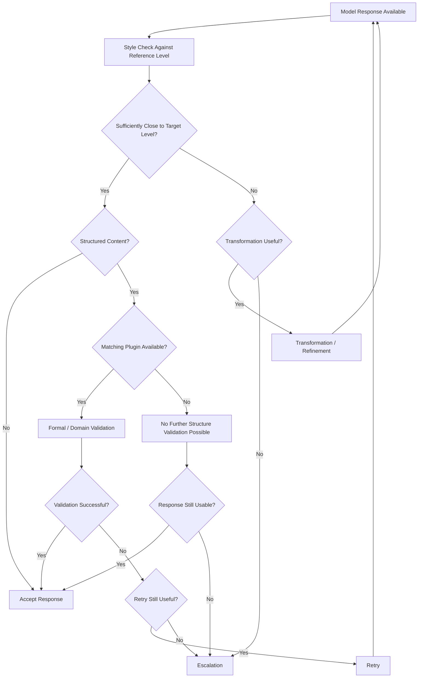

# Decision Model

## Core Principle

After a model response, MDAL does not merely decide whether a result is technically present, but whether that result is usable in the given context. The decision model therefore separates the existence of a response from its usability.

The central question is not: "Did the model produce something?"
The central question is: "Is what was produced sufficiently reliable for the intended user experience and the respective structural requirements?"

The type of check depends on the content type:
- For free-form prose, the primary check is a style evaluation against the reference level.
- For structured content, additional domain-specific or formal validation may take place, but only when a matching validation plugin is available.

## Terminology

To keep the documentation consistent, the following terms are used with deliberate distinctions in MDAL:

### Transformation

Transformation denotes the targeted reshaping of an already existing model response. The existing response core is retained but adjusted to move closer to the desired reference level or expected form.

Typical cases:
- stylistic smoothing
- adjustment of phrasing
- aligning an existing content to a desired response structure, insofar as this is possible without full regeneration

Transformation therefore works on an existing result.

### Refinement

Refinement is the quality-oriented fine-tuning of an already fundamentally usable output. Unlike the general term transformation, refinement is more narrowly directed at improving an already workable output.

Typical cases:
- a response is basically usable but not yet clean enough
- a result is stylistically close to the target level but still too rough
- minor deficiencies are to be corrected without replacing the response core

In practice, refinement is a special case of transformation. When both terms are used in parallel, refinement refers to the finer, quality-oriented form of transformation.

### Retry

Retry does not involve modifying the existing response, but requesting a new model run. The prior result is discarded or only used as a diagnostic basis. The goal is to produce a new output.

Typical cases:
- the existing response is fundamentally insufficient
- a transformation would be less reliable or more costly than a new attempt
- the deviation from the reference level is so large that a fresh run seems more appropriate

## Decision Stages

### 1. Acceptance Without Intervention

A response is accepted directly if it is sufficiently close to the expected reference level in the given context and no relevant violations are detected. This includes in particular:
- sufficient style fidelity for free-form prose
- no critical structural violations for validatable content
- no plugin-side errors where a validation plugin is active

### 2. Transformation / Refinement

A response is not immediately discarded if the deviation can presumably be corrected on the basis of the existing result. In this case a targeted transformation takes place. If the response is already workable and only needs quality refinement, one may more precisely speak of refinement.

Typical triggers:
- stylistic drift from the reference level
- minor formal weaknesses
- insufficient consistency in response behavior
- a basically usable output that still needs polishing

Transformation or refinement is domain-appropriate when the response has a usable core.

### 3. Retry / New Attempt

A retry is used when the response is not sufficiently usable or a transformation would likely not suffice. The goal is a new model run under controlled conditions.

A retry is particularly appropriate when:
- the detected deviation is fundamental in nature
- the response core is not workable enough
- the system expects that quality or structural fidelity can be improved in a further run at acceptable cost

### 4. Escalation

Escalation occurs when no acceptable result could be achieved within the defined operational limits, or when a violation is so severe that a further automatic attempt no longer appears domain-appropriate.

This may be the case, for example, when:
- retry limits have been reached
- for validatable structured content, critical errors persist
- required validation plugins are missing even though no reliable structural statement is possible without them
- the result persistently falls short of the reference level

## Role of Structured Validation

Alongside style checking, MDAL has a second, context-sensitive decision layer: the validation of structured content. This is only activated when a matching validation plugin is present.

This means from a domain perspective:
- free-form prose is primarily checked for style fidelity and transformed if needed
- structured content may additionally be validated domain-specifically or formally
- without a matching plugin, no further quality statement about the structure may be claimed

A result may therefore appear stylistically acceptable but be structurally inadmissible. This is only reliably detectable if a suitable validation plugin is available.

## Decision by Error Type

### Style Deviation in Free-Form Prose

When a response deviates linguistically or stylistically from the target level, this is typically a case for transformation or — with larger deviation — retry.

### Structural Violation in Validatable Content

When an expected structure is violated and a matching validation plugin is active, this is generally more serious than a pure style deviation, since downstream processing in the target system may be at risk.

### Missing Validatability

When structured content is present but the required validation plugin is missing, a domain-level uncertainty arises. In a controlled production environment, this gap must not be treated as a passed quality check.

### Repeated Deviation from Reference Level

When style or structural problems cannot be resolved across multiple attempts, an individual response problem becomes an operational problem. This is precisely the point at which escalation acts as a safeguard.

## Decision Logic Overview

## Domain Boundary

The decision model does not aim to comprehensively evaluate every response from a quality perspective. It aims to correctly utilize the actually available verification basis:
- style checking and transformation if needed for free-form prose
- additional formal or domain validation for structured content with a matching plugin

Within this logic:
- **Transformation** works on an existing response
- **Refinement** is the finer, quality-oriented form of transformation
- **Retry** produces a new response run

This exact distinction prevents conceptual ambiguity in the rest of the documentation.
