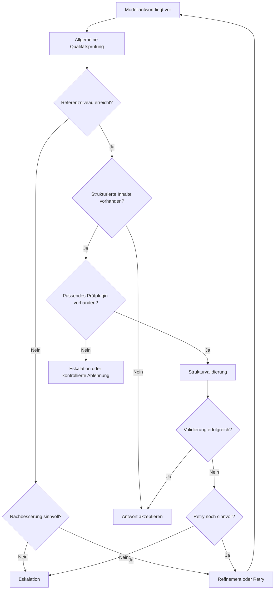

# Entscheidungsmodell

## Grundprinzip

MDAL trifft nach einer Modellantwort nicht nur die Entscheidung, ob technisch ein Ergebnis vorliegt, sondern ob dieses Ergebnis fachlich und qualitativ akzeptabel ist. Das Entscheidungsmodell trennt damit die Existenz einer Antwort von ihrer Verwendbarkeit.

Die zentrale Frage lautet nicht: „Hat das Modell etwas geliefert?“  
Die zentrale Frage lautet: „Ist das Gelieferte für das beabsichtigte Nutzungserlebnis und den jeweiligen Strukturanspruch ausreichend gut?“

## Entscheidungsstufen

### 1. Annahme ohne Eingriff

Eine Antwort wird direkt akzeptiert, wenn sie das erwartete Qualitätsniveau erreicht und keine relevanten Verstöße erkannt werden. Dazu zählt insbesondere:
- ausreichende Nähe zum bekannten Referenzniveau
- keine kritischen Strukturverstöße
- keine schwerwiegenden inhaltlichen Auffälligkeiten im Rahmen der verfügbaren Prüfmechanismen

### 2. Nachbesserung / Refinement

Eine Antwort wird nicht sofort verworfen, wenn die Abweichung voraussichtlich korrigierbar ist. In diesem Fall erfolgt eine gezielte Nachbesserung. Typische Auslöser:
- formale Schwächen
- unvollständige Struktur
- stilistische Drift gegenüber dem Referenzniveau
- kleinere Korrekturbedarfe, die keinen vollständigen Neuansatz erfordern

Refinement ist fachlich sinnvoll, wenn die Antwort einen verwertbaren Kern besitzt, aber noch nicht auf dem gewünschten Qualitätsniveau liegt.

### 3. Retry / Neuversuch

Ein Retry wird verwendet, wenn die Antwort nicht hinreichend verwertbar ist oder eine partielle Nachbesserung nicht genügt. Ziel ist ein erneuter Modelllauf unter kontrollierten Bedingungen.

Ein Retry ist insbesondere dann angemessen, wenn:
- die erkannte Abweichung grundsätzlicher Natur ist
- eine Nachbesserung voraussichtlich teurer oder unsicherer wäre als eine Neuerzeugung
- das System erwartet, dass die Qualität bei einem weiteren Durchlauf mit vertretbarem Aufwand verbessert werden kann

### 4. Eskalation

Eine Eskalation erfolgt, wenn innerhalb der definierten Betriebsgrenzen kein akzeptables Ergebnis erzielt werden konnte oder ein Verstoß so gravierend ist, dass ein weiterer automatischer Versuch fachlich nicht mehr sinnvoll erscheint.

Das kann zum Beispiel dann der Fall sein, wenn:
- Retry-Limits erreicht wurden
- kritische Strukturfehler bestehen bleiben
- notwendige Prüfplugins fehlen, obwohl sie für den konkreten Inhalt erforderlich wären
- das Ergebnis dem Referenzniveau dauerhaft nicht nahekommt

## Rolle der strukturierten Validierung

Neben der allgemeinen Qualitätsprüfung besitzt MDAL eine zweite, besonders wichtige Entscheidungsebene: die Validierung strukturierter Inhalte. Diese wird nur aktiv, wenn ein passendes Prüfplugin vorhanden ist.

Damit gilt fachlich:
- unstrukturierte oder rein sprachliche Qualität kann gegen Fingerprint und allgemeine Prüfregeln bewertet werden
- strukturierte Inhalte benötigen zusätzlich domänenspezifische oder formale Validierung
- die Qualität eines Ergebnisses ist erst dann belastbar beurteilbar, wenn beide Ebenen berücksichtigt wurden

Ein Ergebnis kann daher sprachlich plausibel, aber strukturell unzulässig sein. In diesem Fall darf es nicht als fachlich akzeptiert gelten.

## Entscheidung nach Fehlertyp

### Stil- oder Qualitätsabweichung

Wenn die Antwort sprachlich oder stilistisch vom Zielniveau abweicht, liegt typischerweise ein Fall für Refinement oder Retry vor. Solche Abweichungen sind störend, aber nicht zwangsläufig kritisch.

### Strukturverstoß

Wenn eine erwartete Struktur verletzt wird, ist die Schwere stark kontextabhängig. Bei plugin-gestützter Strukturprüfung ist ein solcher Verstoß in der Regel schwerer zu bewerten als eine reine Stilabweichung, da die Weiterverarbeitung im Zielsystem gefährdet sein kann.

### Fehlende Validierbarkeit

Wenn ein strukturierter Inhalt vorliegt, aber das erforderliche Prüfplugin fehlt, entsteht eine fachliche Unsicherheit. In einem kontrollierten Betrieb darf diese Lücke nicht stillschweigend ignoriert werden. Das Entscheidungsmodell muss dann entweder den Umfang der Aussagekraft begrenzen oder eskalieren.

### Wiederholter Qualitätsmangel

Wenn sich Qualitätsprobleme über mehrere Versuche hinweg nicht beheben lassen, wird aus einem einzelnen Qualitätsmangel ein Betriebsproblem. Genau an diesem Punkt greift Eskalation als Schutzmechanismus.

## Entscheidungslogik im Überblick

## Fachliche Abgrenzung

Das Entscheidungsmodell verfolgt nicht das Ziel, jede Antwort maximal auszuschöpfen. Es verfolgt das Ziel, nur solche Ergebnisse in den Regelbetrieb zu lassen, die das definierte Qualitäts- und Strukturverständnis hinreichend erfüllen.

Damit ist das Modell konservativer als ein einfacher LLM-Wrapper. Genau darin liegt sein fachlicher Nutzen.
