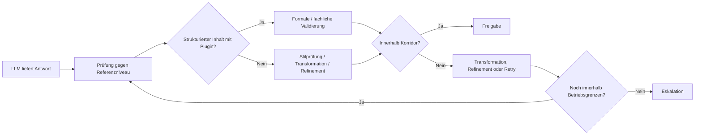

# Betriebsprinzipien und Nicht-Ziele

## Betriebsprinzipien

### Kontrollierte statt unmittelbare Ausgabe

MDAL ist darauf ausgelegt, Modellantworten nicht sofort weiterzureichen, sondern sie zunächst in einen kontrollierten Bewertungsprozess zu überführen. Eine technisch vorhandene Antwort ist noch kein fachlich freigegebenes Ergebnis.

### Stabilisierung statt bloßer Durchleitung

Die Hauptaufgabe von MDAL ist nicht Transport, sondern Stabilisierung. Die Schicht existiert, um Schwankungen in Modellverhalten, Antwortqualität und Strukturtreue abzufedern und in ein verlässlicheres Nutzungserlebnis zu übersetzen.

### Referenzniveau statt pauschaler Qualitätsbehauptung

MDAL prüft Antworten gegen ein bekanntes Referenzniveau. Bei freier Prosa bedeutet das in erster Linie Stilprüfung und gegebenenfalls Transformation oder feinere Nachschärfung im Sinne eines Refinements. Eine weitergehende fachliche oder formale Qualitätsprüfung erfolgt nur dort, wo passende Prüfplugins vorhanden sind.

### Validierung nur bei vorhandener Prüfbasis

Insbesondere bei strukturierten Inhalten gilt: Plausibilität genügt nicht. Wenn geeignete Prüfplugins oder Schemata vorliegen, muss die formale oder fachliche Validierung Teil der Freigabelogik sein. Fehlt diese Prüfbasis, darf auch keine weitergehende Qualitätsaussage suggeriert werden.

### Eskalation statt stiller Verwässerung

Wenn das System die gewünschte Stabilität oder Validität nicht innerhalb definierter Grenzen erreichen kann, ist Eskalation die korrekte Reaktion. MDAL ist nicht dafür da, problematische Ergebnisse unbemerkt in den Regelbetrieb zu schleusen.

## Nicht-Ziele

### Kein Versprechen identischer Ausgaben

MDAL ist kein Mechanismus zur vollständigen Determinisierung von Sprachmodellen. Selbst bei gleichem Input und gleichem Modell kann Variabilität bestehen. Ziel ist nicht Identität, sondern Stabilität im Nutzungserlebnis.

### Kein Ersatz für Domänenlogik

MDAL ersetzt nicht die fachlichen Regeln der konsumierenden Anwendung. Es kann Stiltreue kontrollieren und strukturierte Inhalte validieren, sofern Prüfbasis vorhanden ist, übernimmt aber nicht die vollständige Geschäftslogik eines Zielsystems.

### Keine vollständige Unabhängigkeit vom Modell

MDAL reduziert wahrnehmbare Model-Shift-Effekte, macht eine Anwendung aber nicht vollständig unabhängig vom Verhalten der zugrunde liegenden Modelle. Die Qualität der Basismodelle bleibt weiterhin relevant.

### Keine unbegrenzte automatische Reparatur

Transformation, Refinement und Retry sind kontrollierte Mechanismen, keine Endlosschleifen. Wenn Abweichungen nicht innerhalb definierter Grenzen behebbar sind, muss das System abbrechen oder eskalieren.

### Keine stillschweigende Qualitätsbehauptung ohne Plugin

Wenn strukturierte Inhalte validiert werden müssten, darf das Fehlen eines erforderlichen Plugins nicht in eine implizite Qualitätsfreigabe umgedeutet werden. Ohne Prüfbasis ist nur eine begrenzte Aussage über Verwendbarkeit möglich.

## Leitgedanke

Die Betriebsphilosophie von MDAL lässt sich in einem Satz zusammenfassen:

> Nicht jede Modellantwort ist ein Ergebnis, und nicht jedes Ergebnis ist für den Regelbetrieb geeignet.

Dabei gilt zusätzlich:

> Nicht jede akzeptierte Antwort wurde fachlich vollvalidiert; die Tiefe der Prüfung hängt davon ab, welche Prüfbasis für den jeweiligen Inhalt tatsächlich verfügbar ist.

## Übersicht der Betriebsprinzipien

