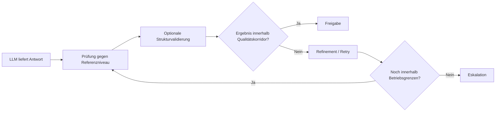

# Betriebsprinzipien und Nicht-Ziele

## Betriebsprinzipien

### Kontrollierte statt unmittelbare Ausgabe

MDAL ist darauf ausgelegt, Modellantworten nicht sofort weiterzureichen, sondern sie zunächst in einen kontrollierten Bewertungsprozess zu überführen. Eine technisch vorhandene Antwort ist noch kein fachlich freigegebenes Ergebnis.

### Stabilisierung statt bloßer Durchleitung

Die Hauptaufgabe von MDAL ist nicht Transport, sondern Stabilisierung. Die Schicht existiert, um Schwankungen in Modellverhalten, Antwortqualität und Strukturtreue abzufedern und in ein verlässlicheres Nutzungserlebnis zu übersetzen.

### Referenzniveau statt Absolutheit

MDAL prüft Antworten gegen ein bekanntes Referenzniveau. Das bedeutet nicht, dass jede Antwort identisch sein muss. Es bedeutet, dass Abweichungen von einem akzeptierten Qualitätskorridor erkennbar und behandelbar werden.

### Validierung vor Vertrauen

Insbesondere bei strukturierten Inhalten gilt: Plausibilität genügt nicht. Wenn strukturierte Ergebnisse erzeugt werden und ein geeignetes Prüfplugin vorhanden ist, muss die formale oder fachliche Validierung Teil der Freigabelogik sein.

### Eskalation statt stiller Verwässerung

Wenn das System die gewünschte Qualität nicht innerhalb definierter Grenzen erreichen kann, ist Eskalation die korrekte Reaktion. MDAL ist nicht dafür da, problematische Ergebnisse unbemerkt in den Regelbetrieb zu schleusen.

## Nicht-Ziele

### Kein Versprechen identischer Ausgaben

MDAL ist kein Mechanismus zur vollständigen Determinisierung von Sprachmodellen. Selbst bei gleichem Input und gleichem Modell kann Variabilität bestehen. Ziel ist nicht Identität, sondern Stabilität im Nutzungserlebnis.

### Kein Ersatz für Domänenlogik

MDAL ersetzt nicht die fachlichen Regeln der konsumierenden Anwendung. Es kann Qualität und Struktur kontrollieren, aber nicht die vollständige Geschäftslogik eines Zielsystems übernehmen.

### Keine vollständige Unabhängigkeit vom Modell

MDAL reduziert wahrnehmbare Model-Shift-Effekte, macht eine Anwendung aber nicht vollständig unabhängig vom Verhalten der zugrunde liegenden Modelle. Die Qualität der Basismodelle bleibt weiterhin relevant.

### Keine unbegrenzte automatische Reparatur

Retry und Refinement sind kontrollierte Mechanismen, keine Endlosschleifen. Wenn Qualitätsmängel nicht innerhalb definierter Grenzen behebbar sind, muss das System abbrechen oder eskalieren.

### Keine stillschweigende Akzeptanz fehlender Prüfbausteine

Wenn strukturierte Inhalte validiert werden müssen, darf das Fehlen eines erforderlichen Plugins nicht still ignoriert werden. Eine solche Lücke ist fachlich relevant und muss in der Entscheidung berücksichtigt werden.

## Leitgedanke

Die Betriebsphilosophie von MDAL lässt sich in einem Satz zusammenfassen:

> Nicht jede Modellantwort ist ein Ergebnis, und nicht jedes Ergebnis ist für den Regelbetrieb geeignet.

Genau deshalb kombiniert MDAL Referenzniveau, Verifikation, strukturierte Validierung, Retry und Eskalation zu einem gemeinsamen Qualitätsmechanismus.

## Übersicht der Betriebsprinzipien

