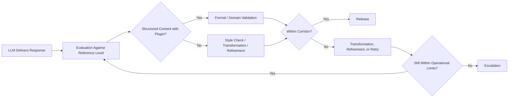

# Operating Principles and Non-Goals

## Operating Principles

### Controlled Rather Than Immediate Output

MDAL is designed not to pass model responses directly to the client, but to route them through a controlled evaluation process first. A technically present response is not yet a domain-approved result.

### Stabilization Rather Than Mere Passthrough

The primary task of MDAL is not transport, but stabilization. The layer exists to absorb fluctuations in model behavior, response quality, and structural fidelity and translate them into a more reliable user experience.

### Reference Level Rather Than Blanket Quality Claims

MDAL evaluates responses against a known reference level. For free-form prose this means primarily style checking and, where necessary, transformation or finer refinement. Further domain-specific or formal quality checking only takes place where matching validation plugins are available.

### Validation Only When Verification Basis Is Present

For structured content in particular: plausibility is not sufficient. If suitable validation plugins or schemas are available, formal or domain validation must be part of the release logic. If this verification basis is missing, no further quality statement may be implied.

### Escalation Rather Than Silent Dilution

If the system cannot achieve the desired stability or validity within defined limits, escalation is the correct response. MDAL is not designed to smuggle problematic results into normal operations unnoticed.

## Non-Goals

### No Promise of Identical Outputs

MDAL is not a mechanism for full determinization of language models. Even with the same input and the same model, variability may exist. The goal is not identity, but stability in the user experience.

### No Replacement for Domain Logic

MDAL does not replace the domain rules of the consuming application. It can control style fidelity and validate structured content where a verification basis exists, but it does not assume the complete business logic of a target system.

### No Complete Independence from the Model

MDAL reduces perceptible model-shift effects, but does not make an application fully independent from the behavior of the underlying models. The quality of the base models remains relevant.

### No Unlimited Automatic Repair

Transformation, refinement, and retry are controlled mechanisms, not endless loops. If deviations cannot be resolved within defined limits, the system must abort or escalate.

### No Silent Quality Claim Without a Plugin

If structured content would need to be validated, the absence of a required plugin must not be reinterpreted as an implicit quality approval. Without a verification basis, only a limited statement about usability is possible.

## Guiding Principle

The operating philosophy of MDAL can be summarized in one sentence:

> Not every model response is a result, and not every result is suitable for production use.

Additionally:

> Not every accepted response has been fully validated from a domain perspective; the depth of verification depends on which verification basis is actually available for the respective content.

## Operating Principles Overview

